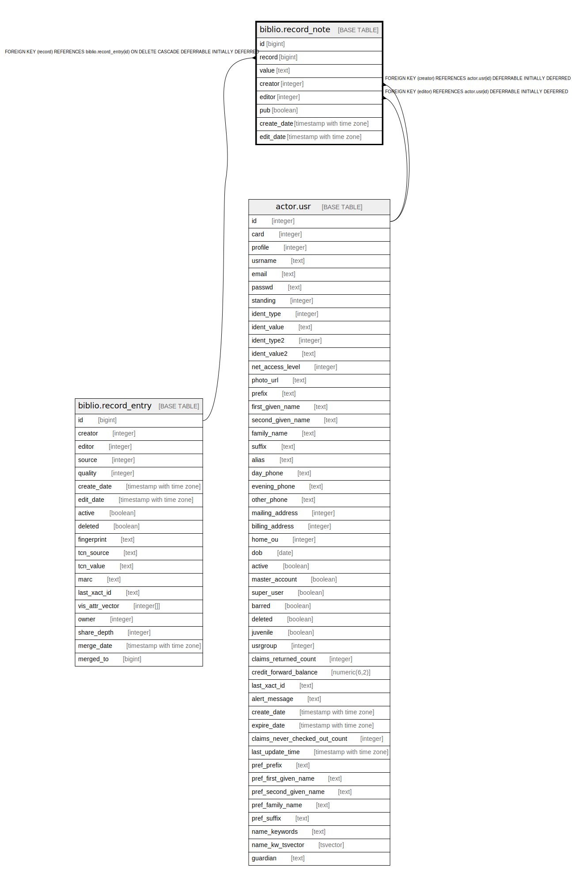

# biblio.record_note

## Description

## Columns

| Name | Type | Default | Nullable | Children | Parents | Comment |
| ---- | ---- | ------- | -------- | -------- | ------- | ------- |
| id | bigint | nextval('biblio.record_note_id_seq'::regclass) | false |  |  |  |
| record | bigint |  | false |  | [biblio.record_entry](biblio.record_entry.md) |  |
| value | text |  | false |  |  |  |
| creator | integer | 1 | false |  | [actor.usr](actor.usr.md) |  |
| editor | integer | 1 | false |  | [actor.usr](actor.usr.md) |  |
| pub | boolean | false | false |  |  |  |
| create_date | timestamp with time zone | now() | false |  |  |  |
| edit_date | timestamp with time zone | now() | false |  |  |  |

## Constraints

| Name | Type | Definition |
| ---- | ---- | ---------- |
| biblio_record_note_creator_fkey | FOREIGN KEY | FOREIGN KEY (creator) REFERENCES actor.usr(id) DEFERRABLE INITIALLY DEFERRED |
| biblio_record_note_editor_fkey | FOREIGN KEY | FOREIGN KEY (editor) REFERENCES actor.usr(id) DEFERRABLE INITIALLY DEFERRED |
| biblio_record_note_record_fkey | FOREIGN KEY | FOREIGN KEY (record) REFERENCES biblio.record_entry(id) ON DELETE CASCADE DEFERRABLE INITIALLY DEFERRED |
| record_note_pkey | PRIMARY KEY | PRIMARY KEY (id) |

## Indexes

| Name | Definition |
| ---- | ---------- |
| record_note_pkey | CREATE UNIQUE INDEX record_note_pkey ON biblio.record_note USING btree (id) |
| biblio_record_note_creator_idx | CREATE INDEX biblio_record_note_creator_idx ON biblio.record_note USING btree (creator) |
| biblio_record_note_editor_idx | CREATE INDEX biblio_record_note_editor_idx ON biblio.record_note USING btree (editor) |
| biblio_record_note_record_idx | CREATE INDEX biblio_record_note_record_idx ON biblio.record_note USING btree (record) |

## Relations

---

> Generated by [tbls](https://github.com/k1LoW/tbls)
