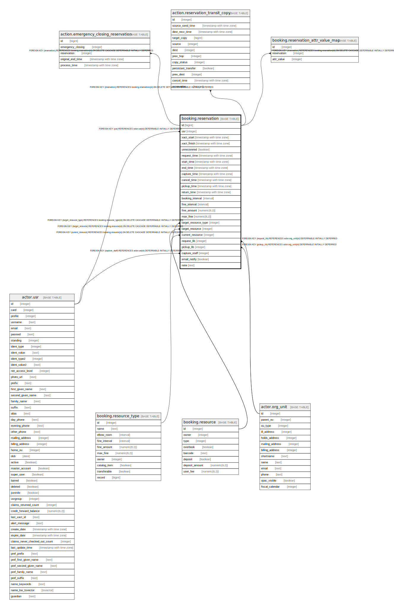

# booking.reservation

## Description

## Columns

| Name | Type | Default | Nullable | Children | Parents | Comment |
| ---- | ---- | ------- | -------- | -------- | ------- | ------- |
| id | bigint | nextval('money.billable_xact_id_seq'::regclass) | false | [action.emergency_closing_reservation](action.emergency_closing_reservation.md) [action.reservation_transit_copy](action.reservation_transit_copy.md) [booking.reservation_attr_value_map](booking.reservation_attr_value_map.md) |  |  |
| usr | integer |  | false |  | [actor.usr](actor.usr.md) |  |
| xact_start | timestamp with time zone | now() | false |  |  |  |
| xact_finish | timestamp with time zone |  | true |  |  |  |
| unrecovered | boolean |  | true |  |  |  |
| request_time | timestamp with time zone | now() | false |  |  |  |
| start_time | timestamp with time zone |  | true |  |  |  |
| end_time | timestamp with time zone |  | true |  |  |  |
| capture_time | timestamp with time zone |  | true |  |  |  |
| cancel_time | timestamp with time zone |  | true |  |  |  |
| pickup_time | timestamp with time zone |  | true |  |  |  |
| return_time | timestamp with time zone |  | true |  |  |  |
| booking_interval | interval |  | true |  |  |  |
| fine_interval | interval |  | true |  |  |  |
| fine_amount | numeric(8,2) |  | true |  |  |  |
| max_fine | numeric(8,2) |  | true |  |  |  |
| target_resource_type | integer |  | false |  | [booking.resource_type](booking.resource_type.md) |  |
| target_resource | integer |  | true |  | [booking.resource](booking.resource.md) |  |
| current_resource | integer |  | true |  | [booking.resource](booking.resource.md) |  |
| request_lib | integer |  | false |  | [actor.org_unit](actor.org_unit.md) |  |
| pickup_lib | integer |  | true |  | [actor.org_unit](actor.org_unit.md) |  |
| capture_staff | integer |  | true |  | [actor.usr](actor.usr.md) |  |
| email_notify | boolean | false | false |  |  |  |
| note | text |  | true |  |  |  |

## Constraints

| Name | Type | Definition |
| ---- | ---- | ---------- |
| reservation_pickup_lib_fkey | FOREIGN KEY | FOREIGN KEY (pickup_lib) REFERENCES actor.org_unit(id) DEFERRABLE INITIALLY DEFERRED |
| reservation_request_lib_fkey | FOREIGN KEY | FOREIGN KEY (request_lib) REFERENCES actor.org_unit(id) DEFERRABLE INITIALLY DEFERRED |
| booking_reservation_usr_fkey | FOREIGN KEY | FOREIGN KEY (usr) REFERENCES actor.usr(id) DEFERRABLE INITIALLY DEFERRED |
| reservation_capture_staff_fkey | FOREIGN KEY | FOREIGN KEY (capture_staff) REFERENCES actor.usr(id) DEFERRABLE INITIALLY DEFERRED |
| reservation_pkey | PRIMARY KEY | PRIMARY KEY (id) |
| reservation_current_resource_fkey | FOREIGN KEY | FOREIGN KEY (current_resource) REFERENCES booking.resource(id) ON DELETE CASCADE DEFERRABLE INITIALLY DEFERRED |
| reservation_target_resource_fkey | FOREIGN KEY | FOREIGN KEY (target_resource) REFERENCES booking.resource(id) ON DELETE CASCADE DEFERRABLE INITIALLY DEFERRED |
| reservation_target_resource_type_fkey | FOREIGN KEY | FOREIGN KEY (target_resource_type) REFERENCES booking.resource_type(id) ON DELETE CASCADE DEFERRABLE INITIALLY DEFERRED |

## Indexes

| Name | Definition |
| ---- | ---------- |
| reservation_pkey | CREATE UNIQUE INDEX reservation_pkey ON booking.reservation USING btree (id) |

## Triggers

| Name | Definition |
| ---- | ---------- |
| mat_summary_change_tgr | CREATE TRIGGER mat_summary_change_tgr AFTER UPDATE ON booking.reservation FOR EACH ROW EXECUTE PROCEDURE money.mat_summary_update() |
| mat_summary_create_tgr | CREATE TRIGGER mat_summary_create_tgr AFTER INSERT ON booking.reservation FOR EACH ROW EXECUTE PROCEDURE money.mat_summary_create('reservation') |
| mat_summary_remove_tgr | CREATE TRIGGER mat_summary_remove_tgr AFTER DELETE ON booking.reservation FOR EACH ROW EXECUTE PROCEDURE money.mat_summary_delete() |

## Relations

---

> Generated by [tbls](https://github.com/k1LoW/tbls)
