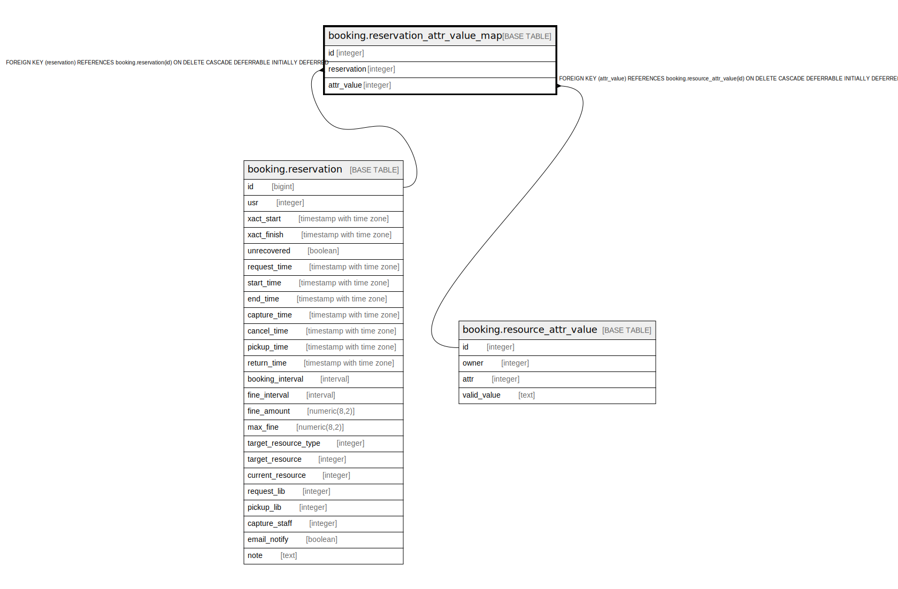

# booking.reservation_attr_value_map

## Description

## Columns

| Name | Type | Default | Nullable | Children | Parents | Comment |
| ---- | ---- | ------- | -------- | -------- | ------- | ------- |
| id | integer | nextval('booking.reservation_attr_value_map_id_seq'::regclass) | false |  |  |  |
| reservation | integer |  | false |  | [booking.reservation](booking.reservation.md) |  |
| attr_value | integer |  | false |  | [booking.resource_attr_value](booking.resource_attr_value.md) |  |

## Constraints

| Name | Type | Definition |
| ---- | ---- | ---------- |
| bravm_logical_key | UNIQUE | UNIQUE (reservation, attr_value) |
| reservation_attr_value_map_pkey | PRIMARY KEY | PRIMARY KEY (id) |
| reservation_attr_value_map_reservation_fkey | FOREIGN KEY | FOREIGN KEY (reservation) REFERENCES booking.reservation(id) ON DELETE CASCADE DEFERRABLE INITIALLY DEFERRED |
| reservation_attr_value_map_attr_value_fkey | FOREIGN KEY | FOREIGN KEY (attr_value) REFERENCES booking.resource_attr_value(id) ON DELETE CASCADE DEFERRABLE INITIALLY DEFERRED |

## Indexes

| Name | Definition |
| ---- | ---------- |
| bravm_logical_key | CREATE UNIQUE INDEX bravm_logical_key ON booking.reservation_attr_value_map USING btree (reservation, attr_value) |
| reservation_attr_value_map_pkey | CREATE UNIQUE INDEX reservation_attr_value_map_pkey ON booking.reservation_attr_value_map USING btree (id) |

## Relations

---

> Generated by [tbls](https://github.com/k1LoW/tbls)
