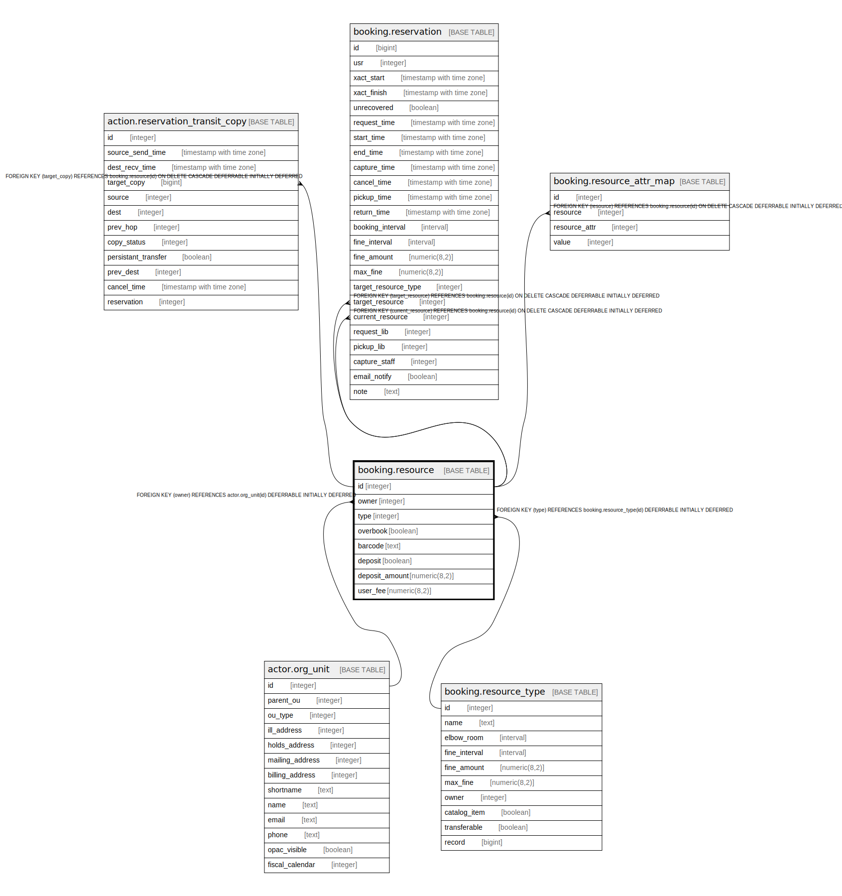

# booking.resource

## Description

## Columns

| Name | Type | Default | Nullable | Children | Parents | Comment |
| ---- | ---- | ------- | -------- | -------- | ------- | ------- |
| id | integer | nextval('booking.resource_id_seq'::regclass) | false | [action.reservation_transit_copy](action.reservation_transit_copy.md) [booking.reservation](booking.reservation.md) [booking.resource_attr_map](booking.resource_attr_map.md) |  |  |
| owner | integer |  | false |  | [actor.org_unit](actor.org_unit.md) |  |
| type | integer |  | false |  | [booking.resource_type](booking.resource_type.md) |  |
| overbook | boolean | false | false |  |  |  |
| barcode | text |  | false |  |  |  |
| deposit | boolean | false | false |  |  |  |
| deposit_amount | numeric(8,2) | 0.00 | false |  |  |  |
| user_fee | numeric(8,2) | 0.00 | false |  |  |  |

## Constraints

| Name | Type | Definition |
| ---- | ---- | ---------- |
| resource_owner_fkey | FOREIGN KEY | FOREIGN KEY (owner) REFERENCES actor.org_unit(id) DEFERRABLE INITIALLY DEFERRED |
| br_unique | UNIQUE | UNIQUE (owner, barcode) |
| resource_pkey | PRIMARY KEY | PRIMARY KEY (id) |
| resource_type_fkey | FOREIGN KEY | FOREIGN KEY (type) REFERENCES booking.resource_type(id) DEFERRABLE INITIALLY DEFERRED |

## Indexes

| Name | Definition |
| ---- | ---------- |
| br_unique | CREATE UNIQUE INDEX br_unique ON booking.resource USING btree (owner, barcode) |
| resource_pkey | CREATE UNIQUE INDEX resource_pkey ON booking.resource USING btree (id) |

## Relations

---

> Generated by [tbls](https://github.com/k1LoW/tbls)
