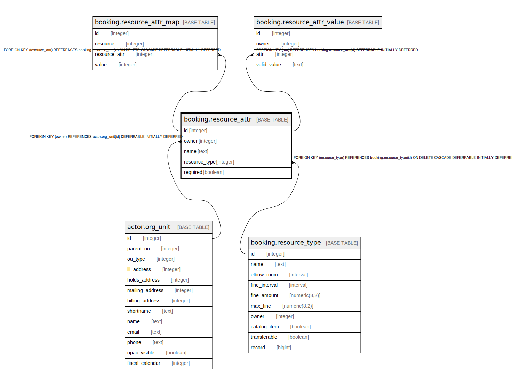

# booking.resource_attr

## Description

## Columns

| Name | Type | Default | Nullable | Children | Parents | Comment |
| ---- | ---- | ------- | -------- | -------- | ------- | ------- |
| id | integer | nextval('booking.resource_attr_id_seq'::regclass) | false | [booking.resource_attr_map](booking.resource_attr_map.md) [booking.resource_attr_value](booking.resource_attr_value.md) |  |  |
| owner | integer |  | false |  | [actor.org_unit](actor.org_unit.md) |  |
| name | text |  | false |  |  |  |
| resource_type | integer |  | false |  | [booking.resource_type](booking.resource_type.md) |  |
| required | boolean | false | false |  |  |  |

## Constraints

| Name | Type | Definition |
| ---- | ---- | ---------- |
| resource_attr_owner_fkey | FOREIGN KEY | FOREIGN KEY (owner) REFERENCES actor.org_unit(id) DEFERRABLE INITIALLY DEFERRED |
| bra_name_once_per_type | UNIQUE | UNIQUE (resource_type, name) |
| resource_attr_pkey | PRIMARY KEY | PRIMARY KEY (id) |
| resource_attr_resource_type_fkey | FOREIGN KEY | FOREIGN KEY (resource_type) REFERENCES booking.resource_type(id) ON DELETE CASCADE DEFERRABLE INITIALLY DEFERRED |

## Indexes

| Name | Definition |
| ---- | ---------- |
| bra_name_once_per_type | CREATE UNIQUE INDEX bra_name_once_per_type ON booking.resource_attr USING btree (resource_type, name) |
| resource_attr_pkey | CREATE UNIQUE INDEX resource_attr_pkey ON booking.resource_attr USING btree (id) |

## Relations

---

> Generated by [tbls](https://github.com/k1LoW/tbls)
