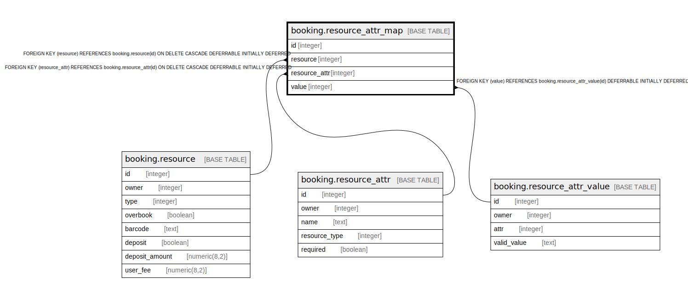

# booking.resource_attr_map

## Description

## Columns

| Name | Type | Default | Nullable | Children | Parents | Comment |
| ---- | ---- | ------- | -------- | -------- | ------- | ------- |
| id | integer | nextval('booking.resource_attr_map_id_seq'::regclass) | false |  |  |  |
| resource | integer |  | false |  | [booking.resource](booking.resource.md) |  |
| resource_attr | integer |  | false |  | [booking.resource_attr](booking.resource_attr.md) |  |
| value | integer |  | false |  | [booking.resource_attr_value](booking.resource_attr_value.md) |  |

## Constraints

| Name | Type | Definition |
| ---- | ---- | ---------- |
| bram_one_value_per_attr | UNIQUE | UNIQUE (resource, resource_attr) |
| resource_attr_map_pkey | PRIMARY KEY | PRIMARY KEY (id) |
| resource_attr_map_resource_attr_fkey | FOREIGN KEY | FOREIGN KEY (resource_attr) REFERENCES booking.resource_attr(id) ON DELETE CASCADE DEFERRABLE INITIALLY DEFERRED |
| resource_attr_map_value_fkey | FOREIGN KEY | FOREIGN KEY (value) REFERENCES booking.resource_attr_value(id) DEFERRABLE INITIALLY DEFERRED |
| resource_attr_map_resource_fkey | FOREIGN KEY | FOREIGN KEY (resource) REFERENCES booking.resource(id) ON DELETE CASCADE DEFERRABLE INITIALLY DEFERRED |

## Indexes

| Name | Definition |
| ---- | ---------- |
| bram_one_value_per_attr | CREATE UNIQUE INDEX bram_one_value_per_attr ON booking.resource_attr_map USING btree (resource, resource_attr) |
| resource_attr_map_pkey | CREATE UNIQUE INDEX resource_attr_map_pkey ON booking.resource_attr_map USING btree (id) |

## Relations

---

> Generated by [tbls](https://github.com/k1LoW/tbls)
