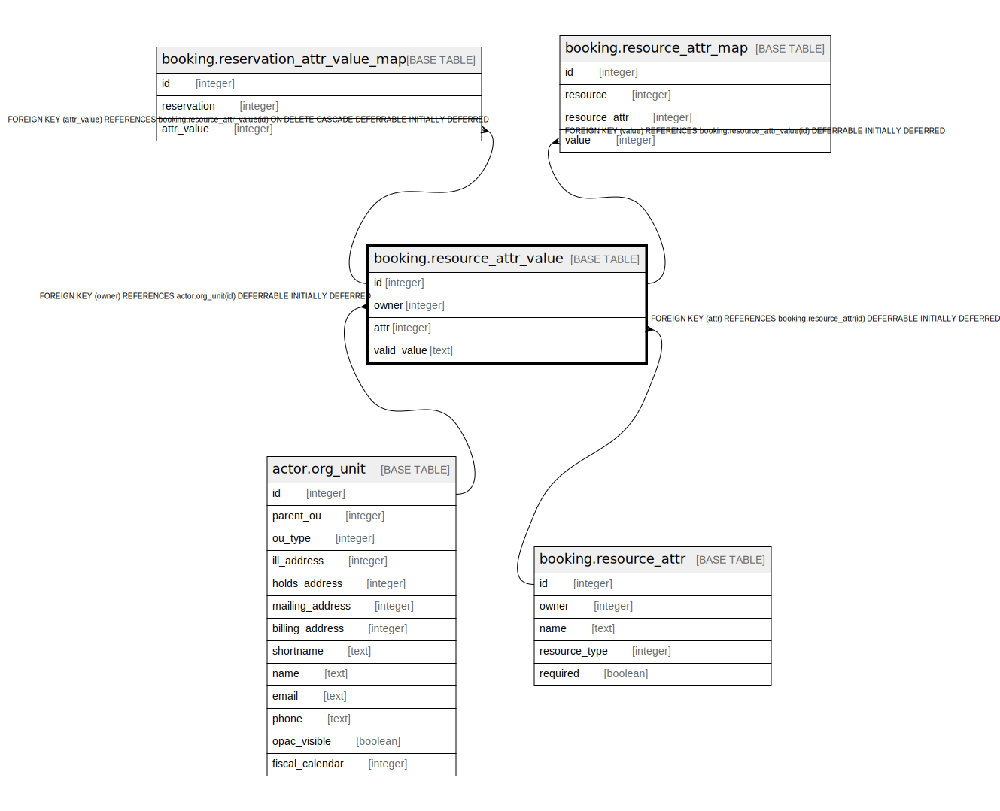

# booking.resource_attr_value

## Description

## Columns

| Name | Type | Default | Nullable | Children | Parents | Comment |
| ---- | ---- | ------- | -------- | -------- | ------- | ------- |
| id | integer | nextval('booking.resource_attr_value_id_seq'::regclass) | false | [booking.reservation_attr_value_map](booking.reservation_attr_value_map.md) [booking.resource_attr_map](booking.resource_attr_map.md) |  |  |
| owner | integer |  | false |  | [actor.org_unit](actor.org_unit.md) |  |
| attr | integer |  | false |  | [booking.resource_attr](booking.resource_attr.md) |  |
| valid_value | text |  | false |  |  |  |

## Constraints

| Name | Type | Definition |
| ---- | ---- | ---------- |
| resource_attr_value_owner_fkey | FOREIGN KEY | FOREIGN KEY (owner) REFERENCES actor.org_unit(id) DEFERRABLE INITIALLY DEFERRED |
| brav_logical_key | UNIQUE | UNIQUE (owner, attr, valid_value) |
| resource_attr_value_attr_fkey | FOREIGN KEY | FOREIGN KEY (attr) REFERENCES booking.resource_attr(id) DEFERRABLE INITIALLY DEFERRED |
| resource_attr_value_pkey | PRIMARY KEY | PRIMARY KEY (id) |

## Indexes

| Name | Definition |
| ---- | ---------- |
| brav_logical_key | CREATE UNIQUE INDEX brav_logical_key ON booking.resource_attr_value USING btree (owner, attr, valid_value) |
| resource_attr_value_pkey | CREATE UNIQUE INDEX resource_attr_value_pkey ON booking.resource_attr_value USING btree (id) |

## Relations

---

> Generated by [tbls](https://github.com/k1LoW/tbls)
