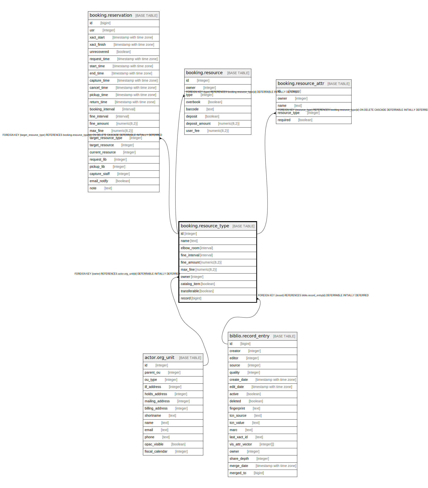

# booking.resource_type

## Description

## Columns

| Name | Type | Default | Nullable | Children | Parents | Comment |
| ---- | ---- | ------- | -------- | -------- | ------- | ------- |
| id | integer | nextval('booking.resource_type_id_seq'::regclass) | false | [booking.reservation](booking.reservation.md) [booking.resource](booking.resource.md) [booking.resource_attr](booking.resource_attr.md) |  |  |
| name | text |  | false |  |  |  |
| elbow_room | interval |  | true |  |  |  |
| fine_interval | interval |  | true |  |  |  |
| fine_amount | numeric(8,2) | 0 | false |  |  |  |
| max_fine | numeric(8,2) |  | true |  |  |  |
| owner | integer |  | false |  | [actor.org_unit](actor.org_unit.md) |  |
| catalog_item | boolean | false | false |  |  |  |
| transferable | boolean | false | false |  |  |  |
| record | bigint |  | true |  | [biblio.record_entry](biblio.record_entry.md) |  |

## Constraints

| Name | Type | Definition |
| ---- | ---- | ---------- |
| resource_type_owner_fkey | FOREIGN KEY | FOREIGN KEY (owner) REFERENCES actor.org_unit(id) DEFERRABLE INITIALLY DEFERRED |
| resource_type_record_fkey | FOREIGN KEY | FOREIGN KEY (record) REFERENCES biblio.record_entry(id) DEFERRABLE INITIALLY DEFERRED |
| brt_name_and_record_once_per_owner | UNIQUE | UNIQUE (owner, name, record) |
| resource_type_pkey | PRIMARY KEY | PRIMARY KEY (id) |

## Indexes

| Name | Definition |
| ---- | ---------- |
| brt_name_and_record_once_per_owner | CREATE UNIQUE INDEX brt_name_and_record_once_per_owner ON booking.resource_type USING btree (owner, name, record) |
| resource_type_pkey | CREATE UNIQUE INDEX resource_type_pkey ON booking.resource_type USING btree (id) |

## Relations

---

> Generated by [tbls](https://github.com/k1LoW/tbls)
