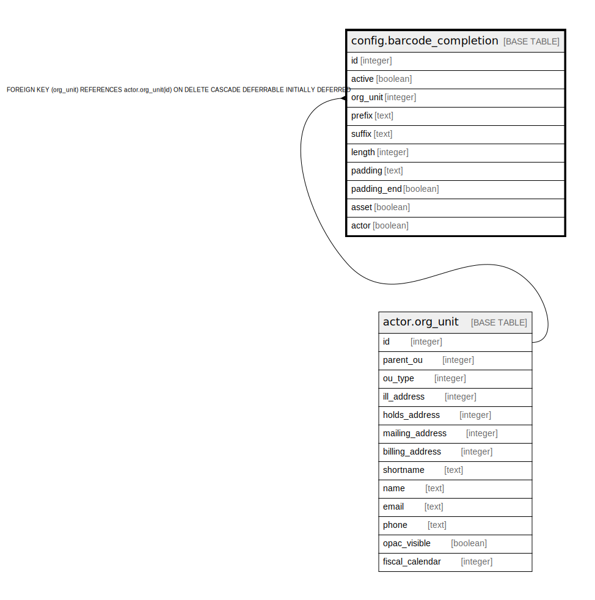

# config.barcode_completion

## Description

## Columns

| Name | Type | Default | Nullable | Children | Parents | Comment |
| ---- | ---- | ------- | -------- | -------- | ------- | ------- |
| id | integer | nextval('config.barcode_completion_id_seq'::regclass) | false |  |  |  |
| active | boolean | true | false |  |  |  |
| org_unit | integer |  | false |  | [actor.org_unit](actor.org_unit.md) |  |
| prefix | text |  | true |  |  |  |
| suffix | text |  | true |  |  |  |
| length | integer | 0 | false |  |  |  |
| padding | text |  | true |  |  |  |
| padding_end | boolean | false | false |  |  |  |
| asset | boolean | true | false |  |  |  |
| actor | boolean | true | false |  |  |  |

## Constraints

| Name | Type | Definition |
| ---- | ---- | ---------- |
| config_barcode_completion_org_unit_fkey | FOREIGN KEY | FOREIGN KEY (org_unit) REFERENCES actor.org_unit(id) ON DELETE CASCADE DEFERRABLE INITIALLY DEFERRED |
| barcode_completion_pkey | PRIMARY KEY | PRIMARY KEY (id) |

## Indexes

| Name | Definition |
| ---- | ---------- |
| barcode_completion_pkey | CREATE UNIQUE INDEX barcode_completion_pkey ON config.barcode_completion USING btree (id) |

## Relations

---

> Generated by [tbls](https://github.com/k1LoW/tbls)
