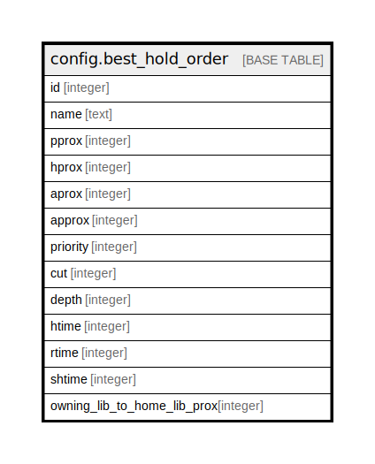

# config.best_hold_order

## Description

## Columns

| Name | Type | Default | Nullable | Children | Parents | Comment |
| ---- | ---- | ------- | -------- | -------- | ------- | ------- |
| id | integer | nextval('config.best_hold_order_id_seq'::regclass) | false |  |  |  |
| name | text |  | true |  |  |  |
| pprox | integer |  | true |  |  |  |
| hprox | integer |  | true |  |  |  |
| aprox | integer |  | true |  |  |  |
| approx | integer |  | true |  |  |  |
| priority | integer |  | true |  |  |  |
| cut | integer |  | true |  |  |  |
| depth | integer |  | true |  |  |  |
| htime | integer |  | true |  |  |  |
| rtime | integer |  | true |  |  |  |
| shtime | integer |  | true |  |  |  |
| owning_lib_to_home_lib_prox | integer |  | true |  |  |  |

## Constraints

| Name | Type | Definition |
| ---- | ---- | ---------- |
| best_hold_order_check | CHECK | CHECK (((pprox IS NOT NULL) OR (hprox IS NOT NULL) OR (owning_lib_to_home_lib_prox IS NOT NULL) OR (aprox IS NOT NULL) OR (priority IS NOT NULL) OR (cut IS NOT NULL) OR (depth IS NOT NULL) OR (htime IS NOT NULL) OR (rtime IS NOT NULL))) |
| best_hold_order_name_key | UNIQUE | UNIQUE (name) |
| best_hold_order_pkey | PRIMARY KEY | PRIMARY KEY (id) |

## Indexes

| Name | Definition |
| ---- | ---------- |
| best_hold_order_name_key | CREATE UNIQUE INDEX best_hold_order_name_key ON config.best_hold_order USING btree (name) |
| best_hold_order_pkey | CREATE UNIQUE INDEX best_hold_order_pkey ON config.best_hold_order USING btree (id) |

## Relations

---

> Generated by [tbls](https://github.com/k1LoW/tbls)
