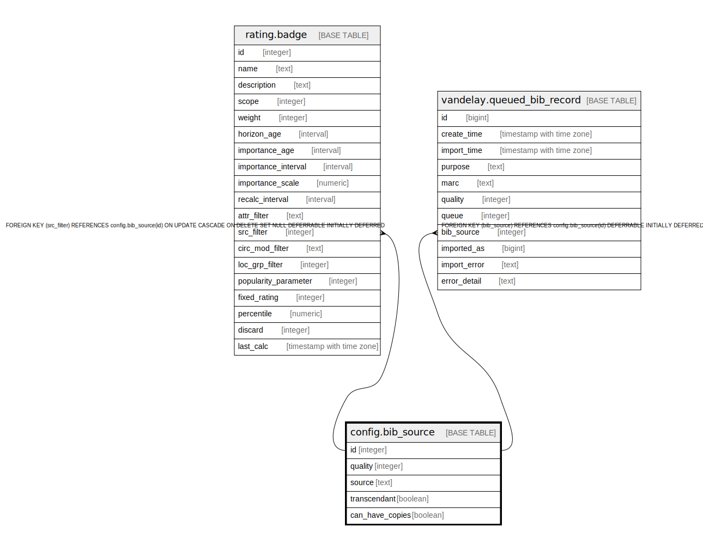

# config.bib_source

## Description

  
This is table is used to set up the relative "quality" of each  
MARC source, such as OCLC.  Also identifies "transcendant" sources,  
i.e., sources of bib records that should display in the OPAC  
even if no copies or located URIs are attached. Also indicates if  
the source is allowed to have actual copies on its bibs. Volumes  
for targeted URIs are unaffected by this setting.  

## Columns

| Name | Type | Default | Nullable | Children | Parents | Comment |
| ---- | ---- | ------- | -------- | -------- | ------- | ------- |
| id | integer | nextval('config.bib_source_id_seq'::regclass) | false | [rating.badge](rating.badge.md) [vandelay.queued_bib_record](vandelay.queued_bib_record.md) |  |  |
| quality | integer |  | true |  |  |  |
| source | text |  | false |  |  |  |
| transcendant | boolean | false | false |  |  |  |
| can_have_copies | boolean | true | false |  |  |  |

## Constraints

| Name | Type | Definition |
| ---- | ---- | ---------- |
| bib_source_quality_check | CHECK | CHECK (((quality >= 0) AND (quality <= 100))) |
| bib_source_pkey | PRIMARY KEY | PRIMARY KEY (id) |
| bib_source_source_key | UNIQUE | UNIQUE (source) |

## Indexes

| Name | Definition |
| ---- | ---------- |
| bib_source_pkey | CREATE UNIQUE INDEX bib_source_pkey ON config.bib_source USING btree (id) |
| bib_source_source_key | CREATE UNIQUE INDEX bib_source_source_key ON config.bib_source USING btree (source) |

## Relations

---

> Generated by [tbls](https://github.com/k1LoW/tbls)
