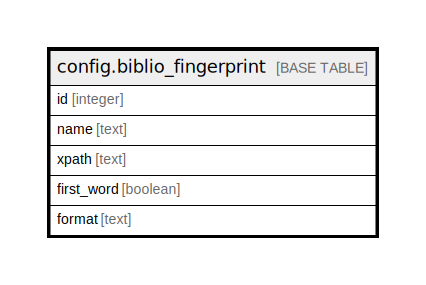

# config.biblio_fingerprint

## Description

## Columns

| Name | Type | Default | Nullable | Children | Parents | Comment |
| ---- | ---- | ------- | -------- | -------- | ------- | ------- |
| id | integer | nextval('config.biblio_fingerprint_id_seq'::regclass) | false |  |  |  |
| name | text |  | false |  |  |  |
| xpath | text |  | false |  |  |  |
| first_word | boolean | false | false |  |  |  |
| format | text | 'marcxml'::text | false |  |  |  |

## Constraints

| Name | Type | Definition |
| ---- | ---- | ---------- |
| biblio_fingerprint_pkey | PRIMARY KEY | PRIMARY KEY (id) |

## Indexes

| Name | Definition |
| ---- | ---------- |
| biblio_fingerprint_pkey | CREATE UNIQUE INDEX biblio_fingerprint_pkey ON config.biblio_fingerprint USING btree (id) |

## Relations

---

> Generated by [tbls](https://github.com/k1LoW/tbls)
