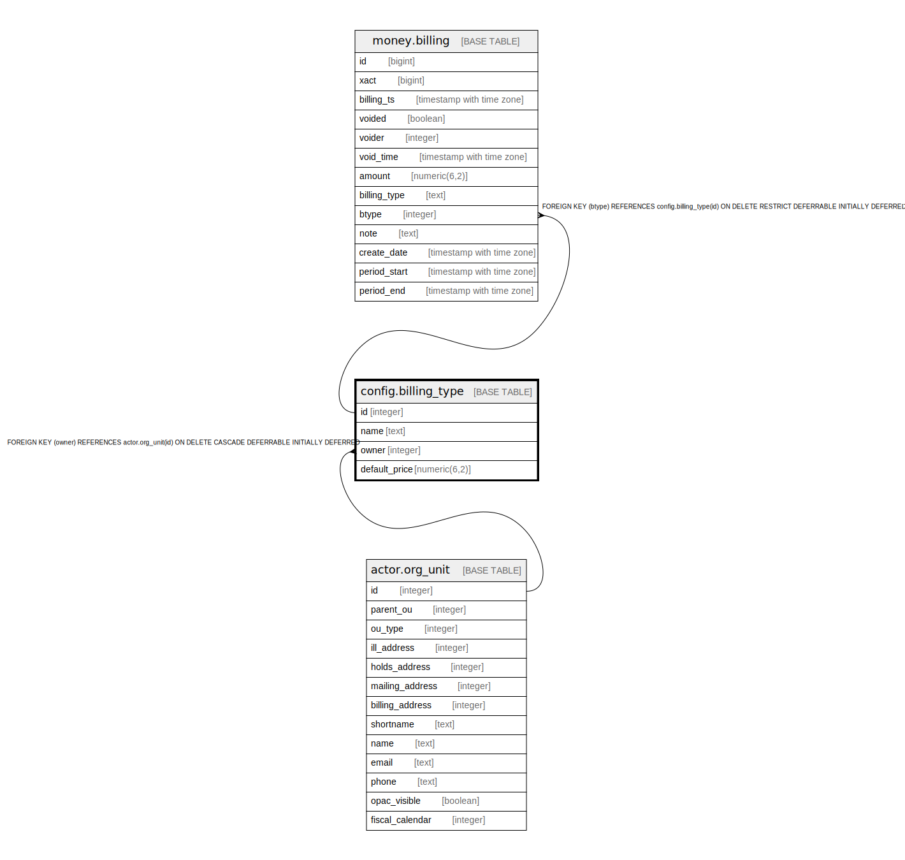

# config.billing_type

## Description

## Columns

| Name | Type | Default | Nullable | Children | Parents | Comment |
| ---- | ---- | ------- | -------- | -------- | ------- | ------- |
| id | integer | nextval('config.billing_type_id_seq'::regclass) | false | [money.billing](money.billing.md) |  |  |
| name | text |  | false |  |  |  |
| owner | integer |  | false |  | [actor.org_unit](actor.org_unit.md) |  |
| default_price | numeric(6,2) |  | true |  |  |  |

## Constraints

| Name | Type | Definition |
| ---- | ---- | ---------- |
| config_billing_type_owner_fkey | FOREIGN KEY | FOREIGN KEY (owner) REFERENCES actor.org_unit(id) ON DELETE CASCADE DEFERRABLE INITIALLY DEFERRED |
| billing_type_once_per_lib | UNIQUE | UNIQUE (name, owner) |
| billing_type_pkey | PRIMARY KEY | PRIMARY KEY (id) |

## Indexes

| Name | Definition |
| ---- | ---------- |
| billing_type_once_per_lib | CREATE UNIQUE INDEX billing_type_once_per_lib ON config.billing_type USING btree (name, owner) |
| billing_type_pkey | CREATE UNIQUE INDEX billing_type_pkey ON config.billing_type USING btree (id) |

## Relations

---

> Generated by [tbls](https://github.com/k1LoW/tbls)
