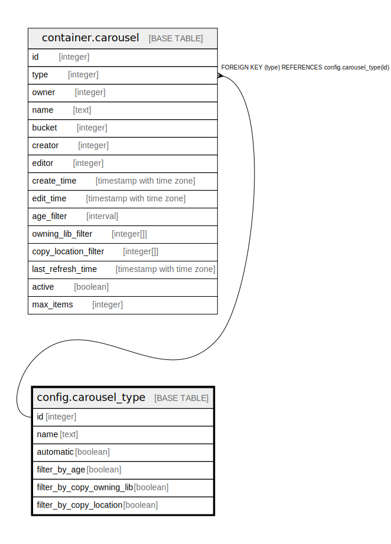

# config.carousel_type

## Description

## Columns

| Name | Type | Default | Nullable | Children | Parents | Comment |
| ---- | ---- | ------- | -------- | -------- | ------- | ------- |
| id | integer | nextval('config.carousel_type_id_seq'::regclass) | false | [container.carousel](container.carousel.md) |  |  |
| name | text |  | false |  |  |  |
| automatic | boolean | true | false |  |  |  |
| filter_by_age | boolean | false | false |  |  |  |
| filter_by_copy_owning_lib | boolean | false | false |  |  |  |
| filter_by_copy_location | boolean | false | false |  |  |  |

## Constraints

| Name | Type | Definition |
| ---- | ---- | ---------- |
| carousel_type_pkey | PRIMARY KEY | PRIMARY KEY (id) |

## Indexes

| Name | Definition |
| ---- | ---------- |
| carousel_type_pkey | CREATE UNIQUE INDEX carousel_type_pkey ON config.carousel_type USING btree (id) |

## Relations

---

> Generated by [tbls](https://github.com/k1LoW/tbls)
