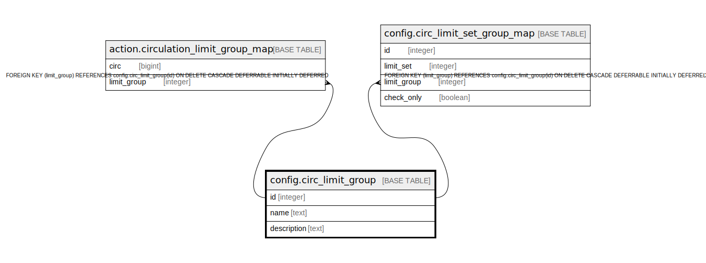

# config.circ_limit_group

## Description

## Columns

| Name | Type | Default | Nullable | Children | Parents | Comment |
| ---- | ---- | ------- | -------- | -------- | ------- | ------- |
| id | integer | nextval('config.circ_limit_group_id_seq'::regclass) | false | [action.circulation_limit_group_map](action.circulation_limit_group_map.md) [config.circ_limit_set_group_map](config.circ_limit_set_group_map.md) |  |  |
| name | text |  | false |  |  |  |
| description | text |  | true |  |  |  |

## Constraints

| Name | Type | Definition |
| ---- | ---- | ---------- |
| circ_limit_group_name_key | UNIQUE | UNIQUE (name) |
| circ_limit_group_pkey | PRIMARY KEY | PRIMARY KEY (id) |

## Indexes

| Name | Definition |
| ---- | ---------- |
| circ_limit_group_name_key | CREATE UNIQUE INDEX circ_limit_group_name_key ON config.circ_limit_group USING btree (name) |
| circ_limit_group_pkey | CREATE UNIQUE INDEX circ_limit_group_pkey ON config.circ_limit_group USING btree (id) |

## Relations

---

> Generated by [tbls](https://github.com/k1LoW/tbls)
