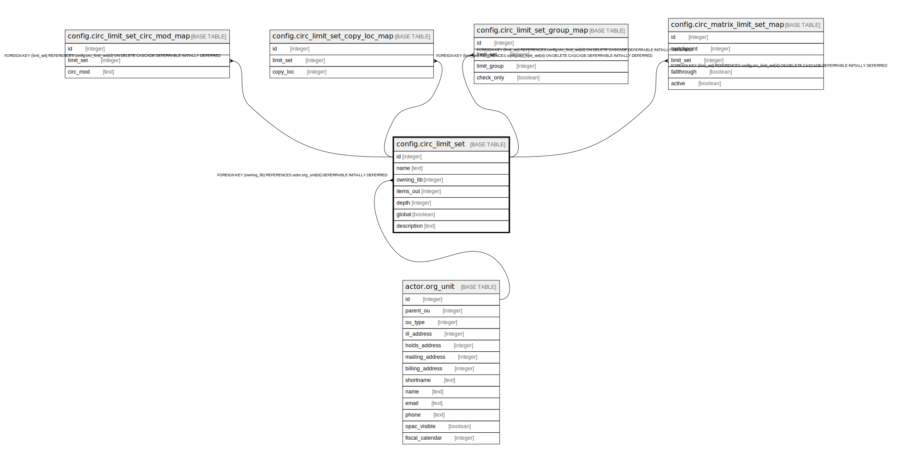

# config.circ_limit_set

## Description

## Columns

| Name | Type | Default | Nullable | Children | Parents | Comment |
| ---- | ---- | ------- | -------- | -------- | ------- | ------- |
| id | integer | nextval('config.circ_limit_set_id_seq'::regclass) | false | [config.circ_limit_set_circ_mod_map](config.circ_limit_set_circ_mod_map.md) [config.circ_limit_set_copy_loc_map](config.circ_limit_set_copy_loc_map.md) [config.circ_limit_set_group_map](config.circ_limit_set_group_map.md) [config.circ_matrix_limit_set_map](config.circ_matrix_limit_set_map.md) |  |  |
| name | text |  | false |  |  |  |
| owning_lib | integer |  | false |  | [actor.org_unit](actor.org_unit.md) |  |
| items_out | integer |  | false |  |  |  |
| depth | integer | 0 | false |  |  |  |
| global | boolean | false | false |  |  |  |
| description | text |  | true |  |  |  |

## Constraints

| Name | Type | Definition |
| ---- | ---- | ---------- |
| circ_limit_set_owning_lib_fkey | FOREIGN KEY | FOREIGN KEY (owning_lib) REFERENCES actor.org_unit(id) DEFERRABLE INITIALLY DEFERRED |
| circ_limit_set_name_key | UNIQUE | UNIQUE (name) |
| circ_limit_set_pkey | PRIMARY KEY | PRIMARY KEY (id) |

## Indexes

| Name | Definition |
| ---- | ---------- |
| circ_limit_set_name_key | CREATE UNIQUE INDEX circ_limit_set_name_key ON config.circ_limit_set USING btree (name) |
| circ_limit_set_pkey | CREATE UNIQUE INDEX circ_limit_set_pkey ON config.circ_limit_set USING btree (id) |

## Relations

---

> Generated by [tbls](https://github.com/k1LoW/tbls)
