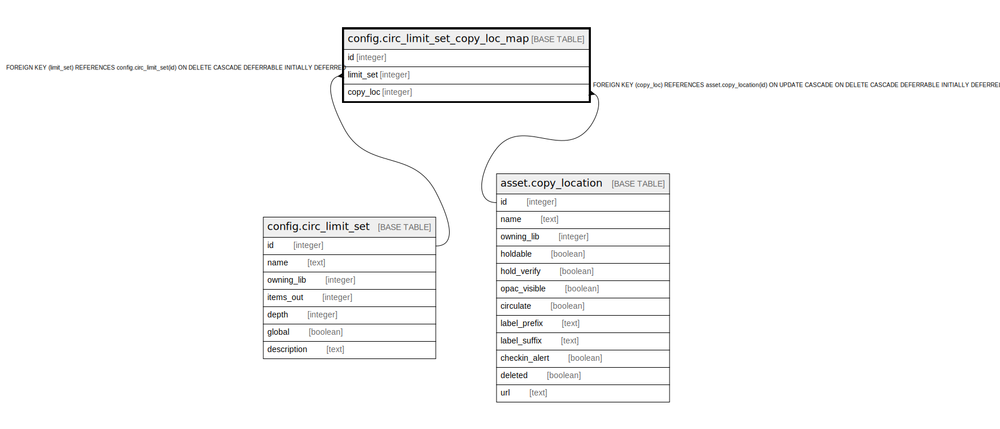

# config.circ_limit_set_copy_loc_map

## Description

## Columns

| Name | Type | Default | Nullable | Children | Parents | Comment |
| ---- | ---- | ------- | -------- | -------- | ------- | ------- |
| id | integer | nextval('config.circ_limit_set_copy_loc_map_id_seq'::regclass) | false |  |  |  |
| limit_set | integer |  | false |  | [config.circ_limit_set](config.circ_limit_set.md) |  |
| copy_loc | integer |  | false |  | [asset.copy_location](asset.copy_location.md) |  |

## Constraints

| Name | Type | Definition |
| ---- | ---- | ---------- |
| circ_limit_set_copy_loc_map_copy_loc_fkey | FOREIGN KEY | FOREIGN KEY (copy_loc) REFERENCES asset.copy_location(id) ON UPDATE CASCADE ON DELETE CASCADE DEFERRABLE INITIALLY DEFERRED |
| circ_limit_set_copy_loc_map_pkey | PRIMARY KEY | PRIMARY KEY (id) |
| circ_limit_set_copy_loc_map_limit_set_fkey | FOREIGN KEY | FOREIGN KEY (limit_set) REFERENCES config.circ_limit_set(id) ON DELETE CASCADE DEFERRABLE INITIALLY DEFERRED |
| cl_once_per_set | UNIQUE | UNIQUE (limit_set, copy_loc) |

## Indexes

| Name | Definition |
| ---- | ---------- |
| circ_limit_set_copy_loc_map_pkey | CREATE UNIQUE INDEX circ_limit_set_copy_loc_map_pkey ON config.circ_limit_set_copy_loc_map USING btree (id) |
| cl_once_per_set | CREATE UNIQUE INDEX cl_once_per_set ON config.circ_limit_set_copy_loc_map USING btree (limit_set, copy_loc) |

## Relations

---

> Generated by [tbls](https://github.com/k1LoW/tbls)
