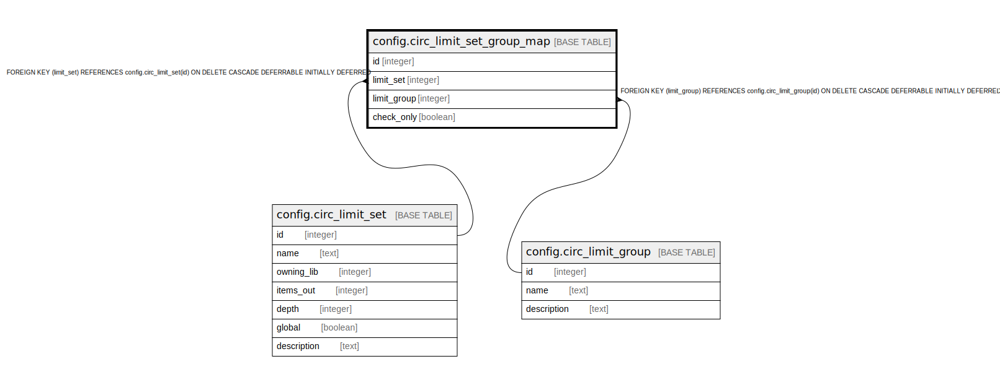

# config.circ_limit_set_group_map

## Description

## Columns

| Name | Type | Default | Nullable | Children | Parents | Comment |
| ---- | ---- | ------- | -------- | -------- | ------- | ------- |
| id | integer | nextval('config.circ_limit_set_group_map_id_seq'::regclass) | false |  |  |  |
| limit_set | integer |  | false |  | [config.circ_limit_set](config.circ_limit_set.md) |  |
| limit_group | integer |  | false |  | [config.circ_limit_group](config.circ_limit_group.md) |  |
| check_only | boolean | false | false |  |  |  |

## Constraints

| Name | Type | Definition |
| ---- | ---- | ---------- |
| circ_limit_set_group_map_limit_group_fkey | FOREIGN KEY | FOREIGN KEY (limit_group) REFERENCES config.circ_limit_group(id) ON DELETE CASCADE DEFERRABLE INITIALLY DEFERRED |
| circ_limit_set_group_map_pkey | PRIMARY KEY | PRIMARY KEY (id) |
| circ_limit_set_group_map_limit_set_fkey | FOREIGN KEY | FOREIGN KEY (limit_set) REFERENCES config.circ_limit_set(id) ON DELETE CASCADE DEFERRABLE INITIALLY DEFERRED |
| clg_once_per_set | UNIQUE | UNIQUE (limit_set, limit_group) |

## Indexes

| Name | Definition |
| ---- | ---------- |
| circ_limit_set_group_map_pkey | CREATE UNIQUE INDEX circ_limit_set_group_map_pkey ON config.circ_limit_set_group_map USING btree (id) |
| clg_once_per_set | CREATE UNIQUE INDEX clg_once_per_set ON config.circ_limit_set_group_map USING btree (limit_set, limit_group) |

## Relations

---

> Generated by [tbls](https://github.com/k1LoW/tbls)
