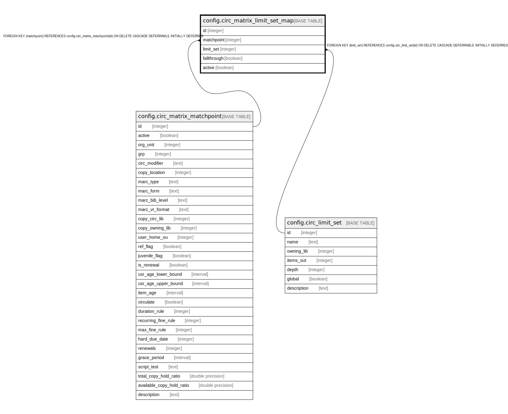

# config.circ_matrix_limit_set_map

## Description

## Columns

| Name | Type | Default | Nullable | Children | Parents | Comment |
| ---- | ---- | ------- | -------- | -------- | ------- | ------- |
| id | integer | nextval('config.circ_matrix_limit_set_map_id_seq'::regclass) | false |  |  |  |
| matchpoint | integer |  | false |  | [config.circ_matrix_matchpoint](config.circ_matrix_matchpoint.md) |  |
| limit_set | integer |  | false |  | [config.circ_limit_set](config.circ_limit_set.md) |  |
| fallthrough | boolean | false | false |  |  |  |
| active | boolean | true | false |  |  |  |

## Constraints

| Name | Type | Definition |
| ---- | ---- | ---------- |
| circ_limit_set_once_per_matchpoint | UNIQUE | UNIQUE (matchpoint, limit_set) |
| circ_matrix_limit_set_map_limit_set_fkey | FOREIGN KEY | FOREIGN KEY (limit_set) REFERENCES config.circ_limit_set(id) ON DELETE CASCADE DEFERRABLE INITIALLY DEFERRED |
| circ_matrix_limit_set_map_pkey | PRIMARY KEY | PRIMARY KEY (id) |
| circ_matrix_limit_set_map_matchpoint_fkey | FOREIGN KEY | FOREIGN KEY (matchpoint) REFERENCES config.circ_matrix_matchpoint(id) ON DELETE CASCADE DEFERRABLE INITIALLY DEFERRED |

## Indexes

| Name | Definition |
| ---- | ---------- |
| circ_limit_set_once_per_matchpoint | CREATE UNIQUE INDEX circ_limit_set_once_per_matchpoint ON config.circ_matrix_limit_set_map USING btree (matchpoint, limit_set) |
| circ_matrix_limit_set_map_pkey | CREATE UNIQUE INDEX circ_matrix_limit_set_map_pkey ON config.circ_matrix_limit_set_map USING btree (id) |

## Relations

---

> Generated by [tbls](https://github.com/k1LoW/tbls)
