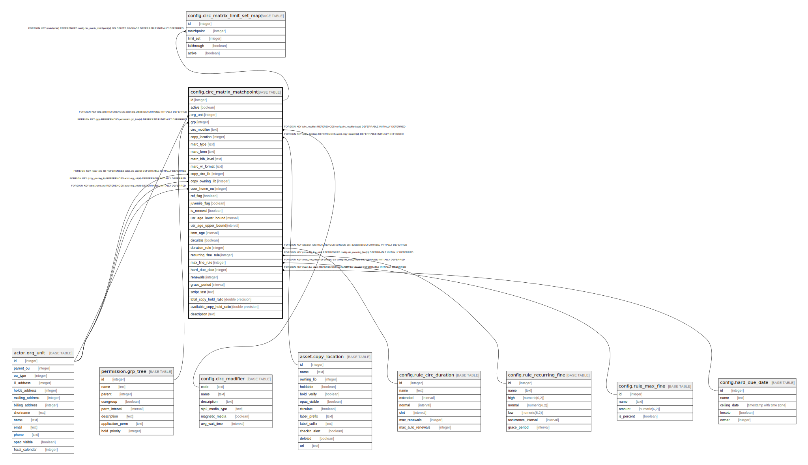

# config.circ_matrix_matchpoint

## Description

## Columns

| Name | Type | Default | Nullable | Children | Parents | Comment |
| ---- | ---- | ------- | -------- | -------- | ------- | ------- |
| id | integer | nextval('config.circ_matrix_matchpoint_id_seq'::regclass) | false | [config.circ_matrix_limit_set_map](config.circ_matrix_limit_set_map.md) |  |  |
| active | boolean | true | false |  |  |  |
| org_unit | integer |  | false |  | [actor.org_unit](actor.org_unit.md) |  |
| grp | integer |  | false |  | [permission.grp_tree](permission.grp_tree.md) |  |
| circ_modifier | text |  | true |  | [config.circ_modifier](config.circ_modifier.md) |  |
| copy_location | integer |  | true |  | [asset.copy_location](asset.copy_location.md) |  |
| marc_type | text |  | true |  |  |  |
| marc_form | text |  | true |  |  |  |
| marc_bib_level | text |  | true |  |  |  |
| marc_vr_format | text |  | true |  |  |  |
| copy_circ_lib | integer |  | true |  | [actor.org_unit](actor.org_unit.md) |  |
| copy_owning_lib | integer |  | true |  | [actor.org_unit](actor.org_unit.md) |  |
| user_home_ou | integer |  | true |  | [actor.org_unit](actor.org_unit.md) |  |
| ref_flag | boolean |  | true |  |  |  |
| juvenile_flag | boolean |  | true |  |  |  |
| is_renewal | boolean |  | true |  |  |  |
| usr_age_lower_bound | interval |  | true |  |  |  |
| usr_age_upper_bound | interval |  | true |  |  |  |
| item_age | interval |  | true |  |  |  |
| circulate | boolean |  | true |  |  |  |
| duration_rule | integer |  | true |  | [config.rule_circ_duration](config.rule_circ_duration.md) |  |
| recurring_fine_rule | integer |  | true |  | [config.rule_recurring_fine](config.rule_recurring_fine.md) |  |
| max_fine_rule | integer |  | true |  | [config.rule_max_fine](config.rule_max_fine.md) |  |
| hard_due_date | integer |  | true |  | [config.hard_due_date](config.hard_due_date.md) |  |
| renewals | integer |  | true |  |  |  |
| grace_period | interval |  | true |  |  |  |
| script_test | text |  | true |  |  |  |
| total_copy_hold_ratio | double precision |  | true |  |  |  |
| available_copy_hold_ratio | double precision |  | true |  |  |  |
| description | text |  | true |  |  |  |

## Constraints

| Name | Type | Definition |
| ---- | ---- | ---------- |
| circ_matrix_matchpoint_copy_circ_lib_fkey | FOREIGN KEY | FOREIGN KEY (copy_circ_lib) REFERENCES actor.org_unit(id) DEFERRABLE INITIALLY DEFERRED |
| circ_matrix_matchpoint_copy_owning_lib_fkey | FOREIGN KEY | FOREIGN KEY (copy_owning_lib) REFERENCES actor.org_unit(id) DEFERRABLE INITIALLY DEFERRED |
| circ_matrix_matchpoint_org_unit_fkey | FOREIGN KEY | FOREIGN KEY (org_unit) REFERENCES actor.org_unit(id) DEFERRABLE INITIALLY DEFERRED |
| circ_matrix_matchpoint_user_home_ou_fkey | FOREIGN KEY | FOREIGN KEY (user_home_ou) REFERENCES actor.org_unit(id) DEFERRABLE INITIALLY DEFERRED |
| circ_matrix_matchpoint_copy_location_fkey | FOREIGN KEY | FOREIGN KEY (copy_location) REFERENCES asset.copy_location(id) DEFERRABLE INITIALLY DEFERRED |
| circ_matrix_matchpoint_pkey | PRIMARY KEY | PRIMARY KEY (id) |
| circ_matrix_matchpoint_circ_modifier_fkey | FOREIGN KEY | FOREIGN KEY (circ_modifier) REFERENCES config.circ_modifier(code) DEFERRABLE INITIALLY DEFERRED |
| circ_matrix_matchpoint_hard_due_date_fkey | FOREIGN KEY | FOREIGN KEY (hard_due_date) REFERENCES config.hard_due_date(id) DEFERRABLE INITIALLY DEFERRED |
| circ_matrix_matchpoint_duration_rule_fkey | FOREIGN KEY | FOREIGN KEY (duration_rule) REFERENCES config.rule_circ_duration(id) DEFERRABLE INITIALLY DEFERRED |
| circ_matrix_matchpoint_max_fine_rule_fkey | FOREIGN KEY | FOREIGN KEY (max_fine_rule) REFERENCES config.rule_max_fine(id) DEFERRABLE INITIALLY DEFERRED |
| circ_matrix_matchpoint_recurring_fine_rule_fkey | FOREIGN KEY | FOREIGN KEY (recurring_fine_rule) REFERENCES config.rule_recurring_fine(id) DEFERRABLE INITIALLY DEFERRED |
| circ_matrix_matchpoint_grp_fkey | FOREIGN KEY | FOREIGN KEY (grp) REFERENCES permission.grp_tree(id) DEFERRABLE INITIALLY DEFERRED |

## Indexes

| Name | Definition |
| ---- | ---------- |
| circ_matrix_matchpoint_pkey | CREATE UNIQUE INDEX circ_matrix_matchpoint_pkey ON config.circ_matrix_matchpoint USING btree (id) |
| ccmm_once_per_paramset | CREATE UNIQUE INDEX ccmm_once_per_paramset ON config.circ_matrix_matchpoint USING btree (org_unit, grp, COALESCE(circ_modifier, ''::text), COALESCE((copy_location)::text, ''::text), COALESCE(marc_type, ''::text), COALESCE(marc_form, ''::text), COALESCE(marc_bib_level, ''::text), COALESCE(marc_vr_format, ''::text), COALESCE((copy_circ_lib)::text, ''::text), COALESCE((copy_owning_lib)::text, ''::text), COALESCE((user_home_ou)::text, ''::text), COALESCE((ref_flag)::text, ''::text), COALESCE((juvenile_flag)::text, ''::text), COALESCE((is_renewal)::text, ''::text), COALESCE((usr_age_lower_bound)::text, ''::text), COALESCE((usr_age_upper_bound)::text, ''::text), COALESCE((item_age)::text, ''::text)) WHERE active |

## Relations

---

> Generated by [tbls](https://github.com/k1LoW/tbls)
