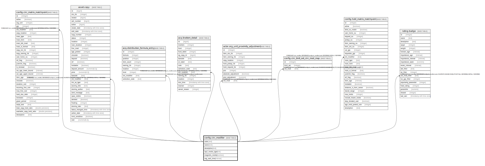

# config.circ_modifier

## Description

## Columns

| Name | Type | Default | Nullable | Children | Parents | Comment |
| ---- | ---- | ------- | -------- | -------- | ------- | ------- |
| code | text |  | false | [config.circ_matrix_matchpoint](config.circ_matrix_matchpoint.md) [asset.copy](asset.copy.md) [acq.distribution_formula_entry](acq.distribution_formula_entry.md) [acq.lineitem_detail](acq.lineitem_detail.md) [actor.org_unit_proximity_adjustment](actor.org_unit_proximity_adjustment.md) [config.circ_limit_set_circ_mod_map](config.circ_limit_set_circ_mod_map.md) [config.hold_matrix_matchpoint](config.hold_matrix_matchpoint.md) [rating.badge](rating.badge.md) |  |  |
| name | text |  | false |  |  |  |
| description | text |  | false |  |  |  |
| sip2_media_type | text |  | false |  |  |  |
| magnetic_media | boolean | true | false |  |  |  |
| avg_wait_time | interval |  | true |  |  |  |

## Constraints

| Name | Type | Definition |
| ---- | ---- | ---------- |
| circ_modifier_name_key | UNIQUE | UNIQUE (name) |
| circ_modifier_pkey | PRIMARY KEY | PRIMARY KEY (code) |

## Indexes

| Name | Definition |
| ---- | ---------- |
| circ_modifier_name_key | CREATE UNIQUE INDEX circ_modifier_name_key ON config.circ_modifier USING btree (name) |
| circ_modifier_pkey | CREATE UNIQUE INDEX circ_modifier_pkey ON config.circ_modifier USING btree (code) |

## Relations

---

> Generated by [tbls](https://github.com/k1LoW/tbls)
