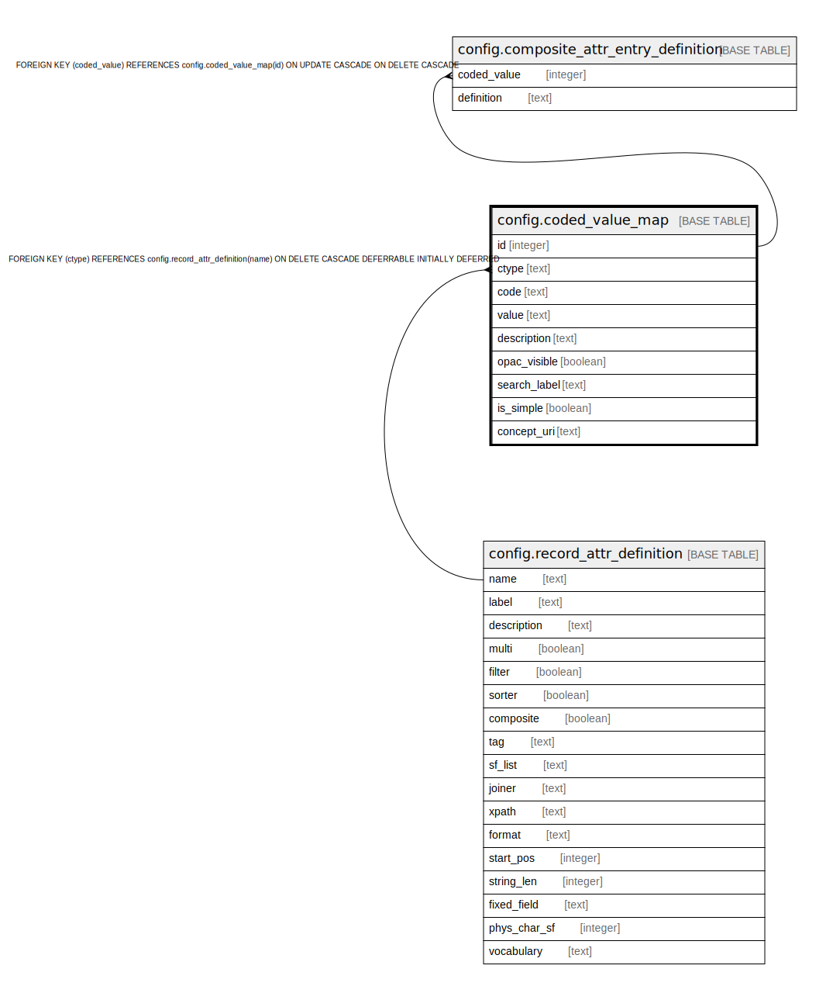

# config.coded_value_map

## Description

## Columns

| Name | Type | Default | Nullable | Children | Parents | Comment |
| ---- | ---- | ------- | -------- | -------- | ------- | ------- |
| id | integer | nextval('config.coded_value_map_id_seq'::regclass) | false | [config.composite_attr_entry_definition](config.composite_attr_entry_definition.md) |  |  |
| ctype | text |  | false |  | [config.record_attr_definition](config.record_attr_definition.md) |  |
| code | text |  | false |  |  |  |
| value | text |  | false |  |  |  |
| description | text |  | true |  |  |  |
| opac_visible | boolean | true | false |  |  |  |
| search_label | text |  | true |  |  |  |
| is_simple | boolean | false | false |  |  |  |
| concept_uri | text |  | true |  |  |  |

## Constraints

| Name | Type | Definition |
| ---- | ---- | ---------- |
| coded_value_map_pkey | PRIMARY KEY | PRIMARY KEY (id) |
| coded_value_map_ctype_fkey | FOREIGN KEY | FOREIGN KEY (ctype) REFERENCES config.record_attr_definition(name) ON DELETE CASCADE DEFERRABLE INITIALLY DEFERRED |

## Indexes

| Name | Definition |
| ---- | ---------- |
| coded_value_map_pkey | CREATE UNIQUE INDEX coded_value_map_pkey ON config.coded_value_map USING btree (id) |
| config_coded_value_map_ctype_idx | CREATE INDEX config_coded_value_map_ctype_idx ON config.coded_value_map USING btree (ctype) |

## Relations

---

> Generated by [tbls](https://github.com/k1LoW/tbls)
