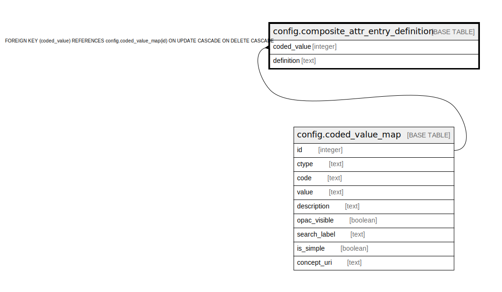

# config.composite_attr_entry_definition

## Description

## Columns

| Name | Type | Default | Nullable | Children | Parents | Comment |
| ---- | ---- | ------- | -------- | -------- | ------- | ------- |
| coded_value | integer |  | false |  | [config.coded_value_map](config.coded_value_map.md) |  |
| definition | text |  | false |  |  |  |

## Constraints

| Name | Type | Definition |
| ---- | ---- | ---------- |
| composite_attr_entry_definition_coded_value_fkey | FOREIGN KEY | FOREIGN KEY (coded_value) REFERENCES config.coded_value_map(id) ON UPDATE CASCADE ON DELETE CASCADE |
| composite_attr_entry_definition_pkey | PRIMARY KEY | PRIMARY KEY (coded_value) |

## Indexes

| Name | Definition |
| ---- | ---------- |
| composite_attr_entry_definition_pkey | CREATE UNIQUE INDEX composite_attr_entry_definition_pkey ON config.composite_attr_entry_definition USING btree (coded_value) |

## Triggers

| Name | Definition |
| ---- | ---------- |
| ccraed_cache_inval_tgr | CREATE TRIGGER ccraed_cache_inval_tgr AFTER INSERT OR DELETE OR UPDATE ON config.composite_attr_entry_definition FOR EACH STATEMENT EXECUTE PROCEDURE metabib.composite_attr_def_cache_inval_tgr() |

## Relations

---

> Generated by [tbls](https://github.com/k1LoW/tbls)
