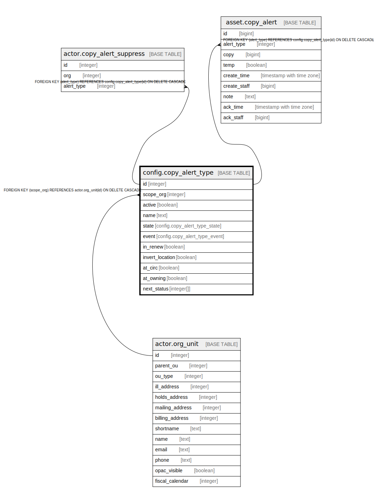

# config.copy_alert_type

## Description

## Columns

| Name | Type | Default | Nullable | Children | Parents | Comment |
| ---- | ---- | ------- | -------- | -------- | ------- | ------- |
| id | integer | nextval('config.copy_alert_type_id_seq'::regclass) | false | [actor.copy_alert_suppress](actor.copy_alert_suppress.md) [asset.copy_alert](asset.copy_alert.md) |  |  |
| scope_org | integer |  | false |  | [actor.org_unit](actor.org_unit.md) |  |
| active | boolean | true | false |  |  |  |
| name | text |  | false |  |  |  |
| state | config.copy_alert_type_state |  | true |  |  |  |
| event | config.copy_alert_type_event |  | true |  |  |  |
| in_renew | boolean |  | true |  |  |  |
| invert_location | boolean | false | false |  |  |  |
| at_circ | boolean |  | true |  |  |  |
| at_owning | boolean |  | true |  |  |  |
| next_status | integer[] |  | true |  |  |  |

## Constraints

| Name | Type | Definition |
| ---- | ---- | ---------- |
| copy_alert_type_scope_org_fkey | FOREIGN KEY | FOREIGN KEY (scope_org) REFERENCES actor.org_unit(id) ON DELETE CASCADE |
| copy_alert_type_name_key | UNIQUE | UNIQUE (name) |
| copy_alert_type_pkey | PRIMARY KEY | PRIMARY KEY (id) |

## Indexes

| Name | Definition |
| ---- | ---------- |
| copy_alert_type_name_key | CREATE UNIQUE INDEX copy_alert_type_name_key ON config.copy_alert_type USING btree (name) |
| copy_alert_type_pkey | CREATE UNIQUE INDEX copy_alert_type_pkey ON config.copy_alert_type USING btree (id) |

## Relations

---

> Generated by [tbls](https://github.com/k1LoW/tbls)
