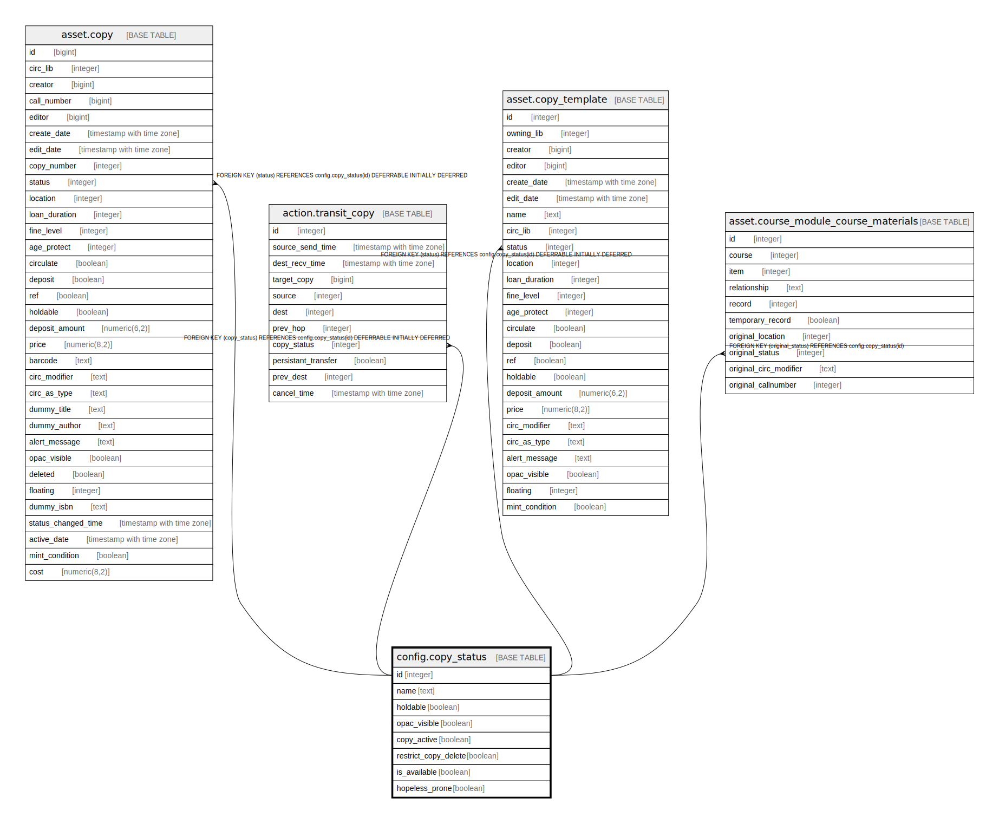

# config.copy_status

## Description

  
Copy Statuses  
  
The available copy statuses, and whether a copy in that  
status is available for hold request capture.  0 (zero) is  
the only special number in this set, meaning that the item  
is available for immediate checkout, and is counted as available  
in the OPAC.  
  
Statuses with an ID below 100 are not removable, and have special  
meaning in the code.  Do not change them except to translate the  
textual name.  
  
You may add and remove statuses above 100, and these can be used  
to remove items from normal circulation without affecting the rest  
of the copy's values or its location.  

## Columns

| Name | Type | Default | Nullable | Children | Parents | Comment |
| ---- | ---- | ------- | -------- | -------- | ------- | ------- |
| id | integer | nextval('config.copy_status_id_seq'::regclass) | false | [asset.copy](asset.copy.md) [action.transit_copy](action.transit_copy.md) [asset.copy_template](asset.copy_template.md) [asset.course_module_course_materials](asset.course_module_course_materials.md) |  |  |
| name | text |  | false |  |  |  |
| holdable | boolean | false | false |  |  |  |
| opac_visible | boolean | false | false |  |  |  |
| copy_active | boolean | false | false |  |  |  |
| restrict_copy_delete | boolean | false | false |  |  |  |
| is_available | boolean | false | false |  |  |  |
| hopeless_prone | boolean | false | false |  |  |  |

## Constraints

| Name | Type | Definition |
| ---- | ---- | ---------- |
| copy_status_name_key | UNIQUE | UNIQUE (name) |
| copy_status_pkey | PRIMARY KEY | PRIMARY KEY (id) |

## Indexes

| Name | Definition |
| ---- | ---------- |
| copy_status_name_key | CREATE UNIQUE INDEX copy_status_name_key ON config.copy_status USING btree (name) |
| copy_status_pkey | CREATE UNIQUE INDEX copy_status_pkey ON config.copy_status USING btree (id) |

## Relations

---

> Generated by [tbls](https://github.com/k1LoW/tbls)
