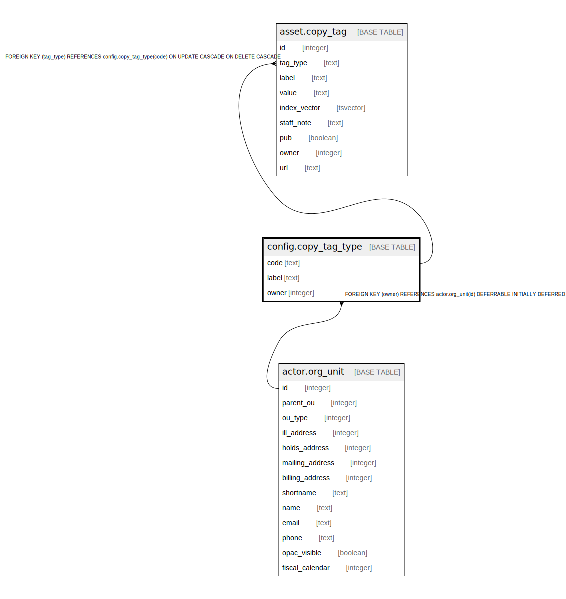

# config.copy_tag_type

## Description

## Columns

| Name | Type | Default | Nullable | Children | Parents | Comment |
| ---- | ---- | ------- | -------- | -------- | ------- | ------- |
| code | text |  | false | [asset.copy_tag](asset.copy_tag.md) |  |  |
| label | text |  | false |  |  |  |
| owner | integer |  | false |  | [actor.org_unit](actor.org_unit.md) |  |

## Constraints

| Name | Type | Definition |
| ---- | ---- | ---------- |
| copy_tag_type_owner_fkey | FOREIGN KEY | FOREIGN KEY (owner) REFERENCES actor.org_unit(id) DEFERRABLE INITIALLY DEFERRED |
| copy_tag_type_pkey | PRIMARY KEY | PRIMARY KEY (code) |

## Indexes

| Name | Definition |
| ---- | ---------- |
| copy_tag_type_pkey | CREATE UNIQUE INDEX copy_tag_type_pkey ON config.copy_tag_type USING btree (code) |
| config_copy_tag_type_owner_idx | CREATE INDEX config_copy_tag_type_owner_idx ON config.copy_tag_type USING btree (owner) |

## Relations

---

> Generated by [tbls](https://github.com/k1LoW/tbls)
