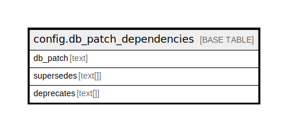

# config.db_patch_dependencies

## Description

## Columns

| Name | Type | Default | Nullable | Children | Parents | Comment |
| ---- | ---- | ------- | -------- | -------- | ------- | ------- |
| db_patch | text |  | false |  |  |  |
| supersedes | text[] |  | true |  |  |  |
| deprecates | text[] |  | true |  |  |  |

## Constraints

| Name | Type | Definition |
| ---- | ---- | ---------- |
| db_patch_dependencies_pkey | PRIMARY KEY | PRIMARY KEY (db_patch) |

## Indexes

| Name | Definition |
| ---- | ---------- |
| db_patch_dependencies_pkey | CREATE UNIQUE INDEX db_patch_dependencies_pkey ON config.db_patch_dependencies USING btree (db_patch) |

## Triggers

| Name | Definition |
| ---- | ---------- |
| no_overlapping_deps | CREATE TRIGGER no_overlapping_deps BEFORE INSERT OR UPDATE ON config.db_patch_dependencies FOR EACH ROW EXECUTE PROCEDURE array_overlap_check('deprecates') |
| no_overlapping_sups | CREATE TRIGGER no_overlapping_sups BEFORE INSERT OR UPDATE ON config.db_patch_dependencies FOR EACH ROW EXECUTE PROCEDURE array_overlap_check('supersedes') |

## Relations

---

> Generated by [tbls](https://github.com/k1LoW/tbls)
