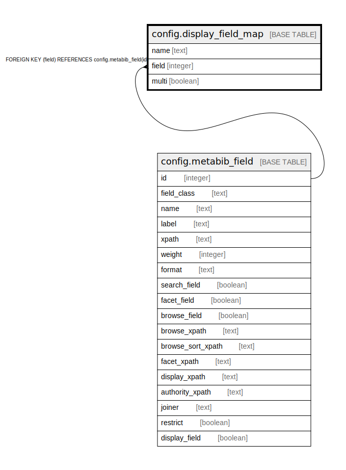

# config.display_field_map

## Description

## Columns

| Name | Type | Default | Nullable | Children | Parents | Comment |
| ---- | ---- | ------- | -------- | -------- | ------- | ------- |
| name | text |  | false |  |  |  |
| field | integer |  | true |  | [config.metabib_field](config.metabib_field.md) |  |
| multi | boolean | false | true |  |  |  |

## Constraints

| Name | Type | Definition |
| ---- | ---- | ---------- |
| display_field_map_pkey | PRIMARY KEY | PRIMARY KEY (name) |
| display_field_map_field_fkey | FOREIGN KEY | FOREIGN KEY (field) REFERENCES config.metabib_field(id) |

## Indexes

| Name | Definition |
| ---- | ---------- |
| display_field_map_pkey | CREATE UNIQUE INDEX display_field_map_pkey ON config.display_field_map USING btree (name) |

## Relations

---

> Generated by [tbls](https://github.com/k1LoW/tbls)
