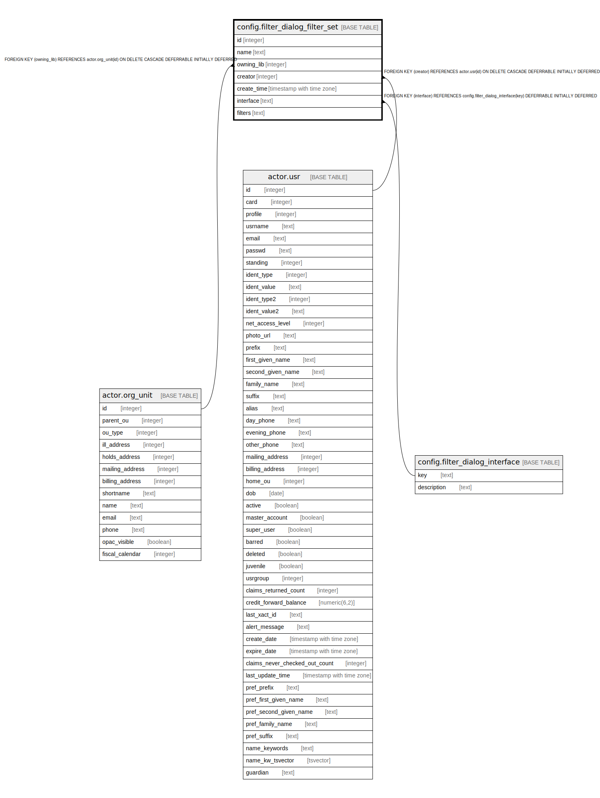

# config.filter_dialog_filter_set

## Description

## Columns

| Name | Type | Default | Nullable | Children | Parents | Comment |
| ---- | ---- | ------- | -------- | -------- | ------- | ------- |
| id | integer | nextval('config.filter_dialog_filter_set_id_seq'::regclass) | false |  |  |  |
| name | text |  | false |  |  |  |
| owning_lib | integer |  | false |  | [actor.org_unit](actor.org_unit.md) |  |
| creator | integer |  | false |  | [actor.usr](actor.usr.md) |  |
| create_time | timestamp with time zone | now() | false |  |  |  |
| interface | text |  | false |  | [config.filter_dialog_interface](config.filter_dialog_interface.md) |  |
| filters | text |  | false |  |  |  |

## Constraints

| Name | Type | Definition |
| ---- | ---- | ---------- |
| config_filter_dialog_filter_set_filters_check | CHECK | CHECK (is_json(filters)) |
| config_filter_dialog_filter_set_owning_lib_fkey | FOREIGN KEY | FOREIGN KEY (owning_lib) REFERENCES actor.org_unit(id) ON DELETE CASCADE DEFERRABLE INITIALLY DEFERRED |
| config_filter_dialog_filter_set_creator_fkey | FOREIGN KEY | FOREIGN KEY (creator) REFERENCES actor.usr(id) ON DELETE CASCADE DEFERRABLE INITIALLY DEFERRED |
| cfdfs_name_once_per_lib | UNIQUE | UNIQUE (name, owning_lib) |
| filter_dialog_filter_set_pkey | PRIMARY KEY | PRIMARY KEY (id) |
| filter_dialog_filter_set_interface_fkey | FOREIGN KEY | FOREIGN KEY (interface) REFERENCES config.filter_dialog_interface(key) DEFERRABLE INITIALLY DEFERRED |

## Indexes

| Name | Definition |
| ---- | ---------- |
| cfdfs_name_once_per_lib | CREATE UNIQUE INDEX cfdfs_name_once_per_lib ON config.filter_dialog_filter_set USING btree (name, owning_lib) |
| filter_dialog_filter_set_pkey | CREATE UNIQUE INDEX filter_dialog_filter_set_pkey ON config.filter_dialog_filter_set USING btree (id) |

## Relations

---

> Generated by [tbls](https://github.com/k1LoW/tbls)
