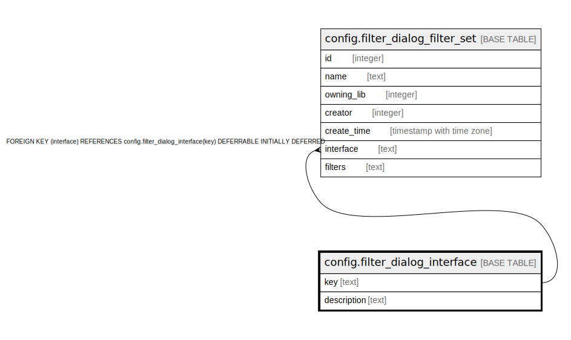

# config.filter_dialog_interface

## Description

## Columns

| Name | Type | Default | Nullable | Children | Parents | Comment |
| ---- | ---- | ------- | -------- | -------- | ------- | ------- |
| key | text |  | false | [config.filter_dialog_filter_set](config.filter_dialog_filter_set.md) |  |  |
| description | text |  | true |  |  |  |

## Constraints

| Name | Type | Definition |
| ---- | ---- | ---------- |
| filter_dialog_interface_pkey | PRIMARY KEY | PRIMARY KEY (key) |

## Indexes

| Name | Definition |
| ---- | ---------- |
| filter_dialog_interface_pkey | CREATE UNIQUE INDEX filter_dialog_interface_pkey ON config.filter_dialog_interface USING btree (key) |

## Relations

---

> Generated by [tbls](https://github.com/k1LoW/tbls)
