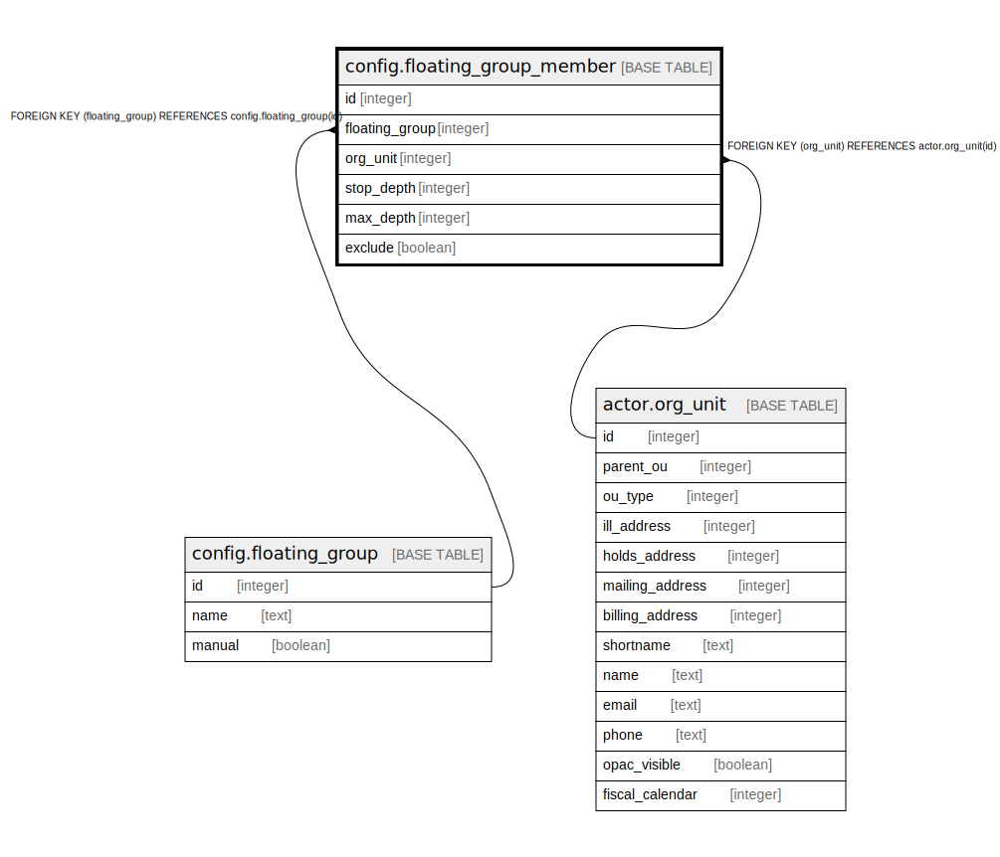

# config.floating_group_member

## Description

## Columns

| Name | Type | Default | Nullable | Children | Parents | Comment |
| ---- | ---- | ------- | -------- | -------- | ------- | ------- |
| id | integer | nextval('config.floating_group_member_id_seq'::regclass) | false |  |  |  |
| floating_group | integer |  | false |  | [config.floating_group](config.floating_group.md) |  |
| org_unit | integer |  | false |  | [actor.org_unit](actor.org_unit.md) |  |
| stop_depth | integer | 0 | false |  |  |  |
| max_depth | integer |  | true |  |  |  |
| exclude | boolean | false | false |  |  |  |

## Constraints

| Name | Type | Definition |
| ---- | ---- | ---------- |
| floating_group_member_org_unit_fkey | FOREIGN KEY | FOREIGN KEY (org_unit) REFERENCES actor.org_unit(id) |
| floating_group_member_pkey | PRIMARY KEY | PRIMARY KEY (id) |
| floating_group_member_floating_group_fkey | FOREIGN KEY | FOREIGN KEY (floating_group) REFERENCES config.floating_group(id) |

## Indexes

| Name | Definition |
| ---- | ---------- |
| floating_group_member_pkey | CREATE UNIQUE INDEX floating_group_member_pkey ON config.floating_group_member USING btree (id) |

## Relations

---

> Generated by [tbls](https://github.com/k1LoW/tbls)
