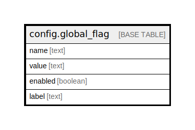

# config.global_flag

## Description

## Columns

| Name | Type | Default | Nullable | Children | Parents | Comment |
| ---- | ---- | ------- | -------- | -------- | ------- | ------- |
| name | text |  | false |  |  |  |
| value | text |  | true |  |  |  |
| enabled | boolean | false | false |  |  |  |
| label | text |  | false |  |  |  |

## Constraints

| Name | Type | Definition |
| ---- | ---- | ---------- |
| global_flag_pkey | PRIMARY KEY | PRIMARY KEY (name) |

## Indexes

| Name | Definition |
| ---- | ---------- |
| global_flag_pkey | CREATE UNIQUE INDEX global_flag_pkey ON config.global_flag USING btree (name) |

## Relations

---

> Generated by [tbls](https://github.com/k1LoW/tbls)
