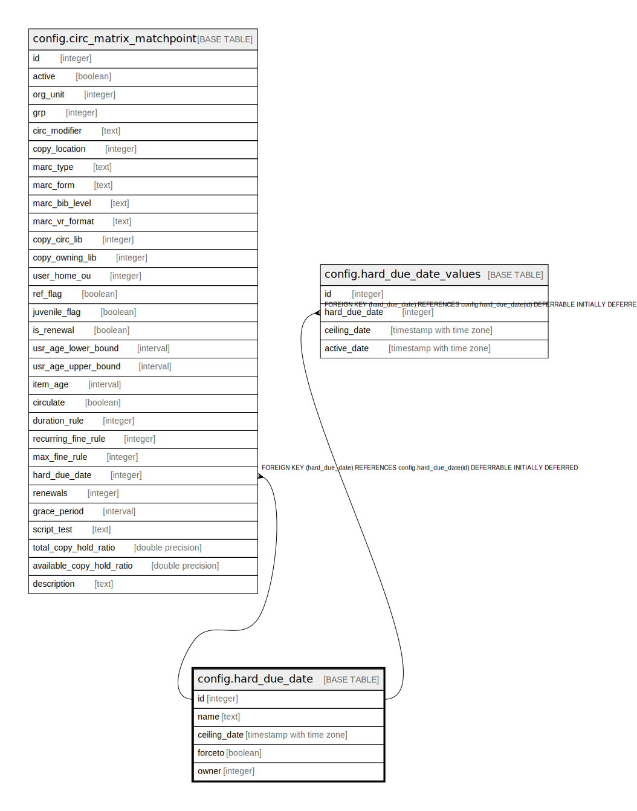

# config.hard_due_date

## Description

## Columns

| Name | Type | Default | Nullable | Children | Parents | Comment |
| ---- | ---- | ------- | -------- | -------- | ------- | ------- |
| id | integer | nextval('config.hard_due_date_id_seq'::regclass) | false | [config.circ_matrix_matchpoint](config.circ_matrix_matchpoint.md) [config.hard_due_date_values](config.hard_due_date_values.md) |  |  |
| name | text |  | false |  |  |  |
| ceiling_date | timestamp with time zone |  | false |  |  |  |
| forceto | boolean |  | false |  |  |  |
| owner | integer |  | false |  |  |  |

## Constraints

| Name | Type | Definition |
| ---- | ---- | ---------- |
| hard_due_date_name_key | UNIQUE | UNIQUE (name) |
| hard_due_date_pkey | PRIMARY KEY | PRIMARY KEY (id) |

## Indexes

| Name | Definition |
| ---- | ---------- |
| hard_due_date_name_key | CREATE UNIQUE INDEX hard_due_date_name_key ON config.hard_due_date USING btree (name) |
| hard_due_date_pkey | CREATE UNIQUE INDEX hard_due_date_pkey ON config.hard_due_date USING btree (id) |

## Relations

---

> Generated by [tbls](https://github.com/k1LoW/tbls)
