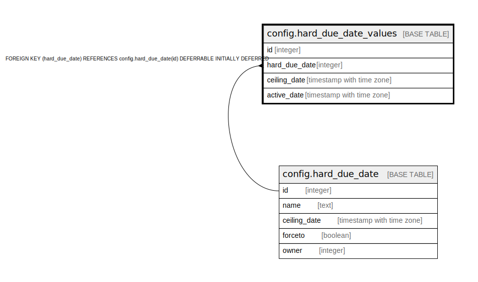

# config.hard_due_date_values

## Description

## Columns

| Name | Type | Default | Nullable | Children | Parents | Comment |
| ---- | ---- | ------- | -------- | -------- | ------- | ------- |
| id | integer | nextval('config.hard_due_date_values_id_seq'::regclass) | false |  |  |  |
| hard_due_date | integer |  | false |  | [config.hard_due_date](config.hard_due_date.md) |  |
| ceiling_date | timestamp with time zone |  | false |  |  |  |
| active_date | timestamp with time zone |  | false |  |  |  |

## Constraints

| Name | Type | Definition |
| ---- | ---- | ---------- |
| hard_due_date_values_hard_due_date_fkey | FOREIGN KEY | FOREIGN KEY (hard_due_date) REFERENCES config.hard_due_date(id) DEFERRABLE INITIALLY DEFERRED |
| hard_due_date_values_pkey | PRIMARY KEY | PRIMARY KEY (id) |

## Indexes

| Name | Definition |
| ---- | ---------- |
| hard_due_date_values_pkey | CREATE UNIQUE INDEX hard_due_date_values_pkey ON config.hard_due_date_values USING btree (id) |

## Relations

---

> Generated by [tbls](https://github.com/k1LoW/tbls)
