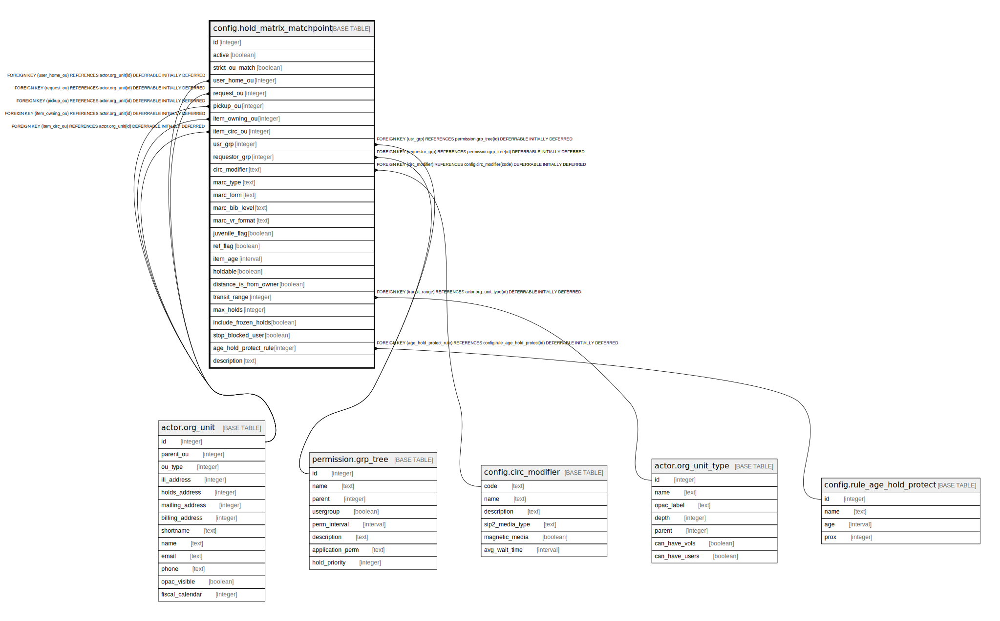

# config.hold_matrix_matchpoint

## Description

## Columns

| Name | Type | Default | Nullable | Children | Parents | Comment |
| ---- | ---- | ------- | -------- | -------- | ------- | ------- |
| id | integer | nextval('config.hold_matrix_matchpoint_id_seq'::regclass) | false |  |  |  |
| active | boolean | true | false |  |  |  |
| strict_ou_match | boolean | false | false |  |  |  |
| user_home_ou | integer |  | true |  | [actor.org_unit](actor.org_unit.md) |  |
| request_ou | integer |  | true |  | [actor.org_unit](actor.org_unit.md) |  |
| pickup_ou | integer |  | true |  | [actor.org_unit](actor.org_unit.md) |  |
| item_owning_ou | integer |  | true |  | [actor.org_unit](actor.org_unit.md) |  |
| item_circ_ou | integer |  | true |  | [actor.org_unit](actor.org_unit.md) |  |
| usr_grp | integer |  | true |  | [permission.grp_tree](permission.grp_tree.md) |  |
| requestor_grp | integer |  | false |  | [permission.grp_tree](permission.grp_tree.md) |  |
| circ_modifier | text |  | true |  | [config.circ_modifier](config.circ_modifier.md) |  |
| marc_type | text |  | true |  |  |  |
| marc_form | text |  | true |  |  |  |
| marc_bib_level | text |  | true |  |  |  |
| marc_vr_format | text |  | true |  |  |  |
| juvenile_flag | boolean |  | true |  |  |  |
| ref_flag | boolean |  | true |  |  |  |
| item_age | interval |  | true |  |  |  |
| holdable | boolean | true | false |  |  |  |
| distance_is_from_owner | boolean | false | false |  |  |  |
| transit_range | integer |  | true |  | [actor.org_unit_type](actor.org_unit_type.md) |  |
| max_holds | integer |  | true |  |  |  |
| include_frozen_holds | boolean | true | false |  |  |  |
| stop_blocked_user | boolean | false | false |  |  |  |
| age_hold_protect_rule | integer |  | true |  | [config.rule_age_hold_protect](config.rule_age_hold_protect.md) |  |
| description | text |  | true |  |  |  |

## Constraints

| Name | Type | Definition |
| ---- | ---- | ---------- |
| hold_matrix_matchpoint_item_circ_ou_fkey | FOREIGN KEY | FOREIGN KEY (item_circ_ou) REFERENCES actor.org_unit(id) DEFERRABLE INITIALLY DEFERRED |
| hold_matrix_matchpoint_item_owning_ou_fkey | FOREIGN KEY | FOREIGN KEY (item_owning_ou) REFERENCES actor.org_unit(id) DEFERRABLE INITIALLY DEFERRED |
| hold_matrix_matchpoint_pickup_ou_fkey | FOREIGN KEY | FOREIGN KEY (pickup_ou) REFERENCES actor.org_unit(id) DEFERRABLE INITIALLY DEFERRED |
| hold_matrix_matchpoint_request_ou_fkey | FOREIGN KEY | FOREIGN KEY (request_ou) REFERENCES actor.org_unit(id) DEFERRABLE INITIALLY DEFERRED |
| hold_matrix_matchpoint_user_home_ou_fkey | FOREIGN KEY | FOREIGN KEY (user_home_ou) REFERENCES actor.org_unit(id) DEFERRABLE INITIALLY DEFERRED |
| hold_matrix_matchpoint_transit_range_fkey | FOREIGN KEY | FOREIGN KEY (transit_range) REFERENCES actor.org_unit_type(id) DEFERRABLE INITIALLY DEFERRED |
| hold_matrix_matchpoint_circ_modifier_fkey | FOREIGN KEY | FOREIGN KEY (circ_modifier) REFERENCES config.circ_modifier(code) DEFERRABLE INITIALLY DEFERRED |
| hold_matrix_matchpoint_pkey | PRIMARY KEY | PRIMARY KEY (id) |
| hold_matrix_matchpoint_age_hold_protect_rule_fkey | FOREIGN KEY | FOREIGN KEY (age_hold_protect_rule) REFERENCES config.rule_age_hold_protect(id) DEFERRABLE INITIALLY DEFERRED |
| hold_matrix_matchpoint_requestor_grp_fkey | FOREIGN KEY | FOREIGN KEY (requestor_grp) REFERENCES permission.grp_tree(id) DEFERRABLE INITIALLY DEFERRED |
| hold_matrix_matchpoint_usr_grp_fkey | FOREIGN KEY | FOREIGN KEY (usr_grp) REFERENCES permission.grp_tree(id) DEFERRABLE INITIALLY DEFERRED |

## Indexes

| Name | Definition |
| ---- | ---------- |
| hold_matrix_matchpoint_pkey | CREATE UNIQUE INDEX hold_matrix_matchpoint_pkey ON config.hold_matrix_matchpoint USING btree (id) |
| chmm_once_per_paramset | CREATE UNIQUE INDEX chmm_once_per_paramset ON config.hold_matrix_matchpoint USING btree (COALESCE((user_home_ou)::text, ''::text), COALESCE((request_ou)::text, ''::text), COALESCE((pickup_ou)::text, ''::text), COALESCE((item_owning_ou)::text, ''::text), COALESCE((item_circ_ou)::text, ''::text), COALESCE((usr_grp)::text, ''::text), COALESCE((requestor_grp)::text, ''::text), COALESCE(circ_modifier, ''::text), COALESCE(marc_type, ''::text), COALESCE(marc_form, ''::text), COALESCE(marc_bib_level, ''::text), COALESCE(marc_vr_format, ''::text), COALESCE((juvenile_flag)::text, ''::text), COALESCE((ref_flag)::text, ''::text), COALESCE((item_age)::text, ''::text)) WHERE active |

## Relations

---

> Generated by [tbls](https://github.com/k1LoW/tbls)
