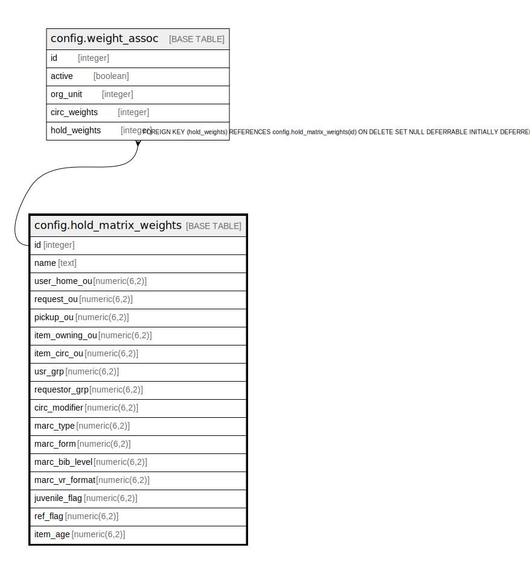

# config.hold_matrix_weights

## Description

## Columns

| Name | Type | Default | Nullable | Children | Parents | Comment |
| ---- | ---- | ------- | -------- | -------- | ------- | ------- |
| id | integer | nextval('config.hold_matrix_weights_id_seq'::regclass) | false | [config.weight_assoc](config.weight_assoc.md) |  |  |
| name | text |  | false |  |  |  |
| user_home_ou | numeric(6,2) |  | false |  |  |  |
| request_ou | numeric(6,2) |  | false |  |  |  |
| pickup_ou | numeric(6,2) |  | false |  |  |  |
| item_owning_ou | numeric(6,2) |  | false |  |  |  |
| item_circ_ou | numeric(6,2) |  | false |  |  |  |
| usr_grp | numeric(6,2) |  | false |  |  |  |
| requestor_grp | numeric(6,2) |  | false |  |  |  |
| circ_modifier | numeric(6,2) |  | false |  |  |  |
| marc_type | numeric(6,2) |  | false |  |  |  |
| marc_form | numeric(6,2) |  | false |  |  |  |
| marc_bib_level | numeric(6,2) |  | false |  |  |  |
| marc_vr_format | numeric(6,2) |  | false |  |  |  |
| juvenile_flag | numeric(6,2) |  | false |  |  |  |
| ref_flag | numeric(6,2) |  | false |  |  |  |
| item_age | numeric(6,2) |  | false |  |  |  |

## Constraints

| Name | Type | Definition |
| ---- | ---- | ---------- |
| hold_matrix_weights_name_key | UNIQUE | UNIQUE (name) |
| hold_matrix_weights_pkey | PRIMARY KEY | PRIMARY KEY (id) |

## Indexes

| Name | Definition |
| ---- | ---------- |
| hold_matrix_weights_name_key | CREATE UNIQUE INDEX hold_matrix_weights_name_key ON config.hold_matrix_weights USING btree (name) |
| hold_matrix_weights_pkey | CREATE UNIQUE INDEX hold_matrix_weights_pkey ON config.hold_matrix_weights USING btree (id) |

## Relations

---

> Generated by [tbls](https://github.com/k1LoW/tbls)
