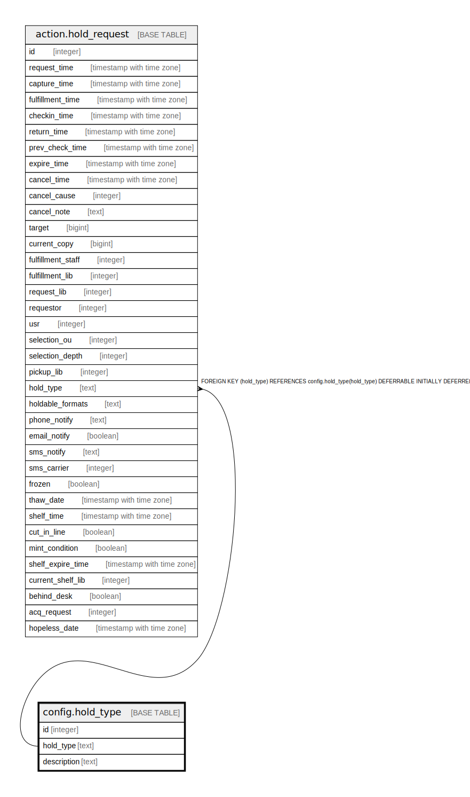

# config.hold_type

## Description

## Columns

| Name | Type | Default | Nullable | Children | Parents | Comment |
| ---- | ---- | ------- | -------- | -------- | ------- | ------- |
| id | integer | nextval('config.hold_type_id_seq'::regclass) | false |  |  |  |
| hold_type | text |  | true | [action.hold_request](action.hold_request.md) |  |  |
| description | text |  | true |  |  |  |

## Constraints

| Name | Type | Definition |
| ---- | ---- | ---------- |
| hold_type_hold_type_key | UNIQUE | UNIQUE (hold_type) |

## Indexes

| Name | Definition |
| ---- | ---------- |
| hold_type_hold_type_key | CREATE UNIQUE INDEX hold_type_hold_type_key ON config.hold_type USING btree (hold_type) |

## Relations

---

> Generated by [tbls](https://github.com/k1LoW/tbls)
