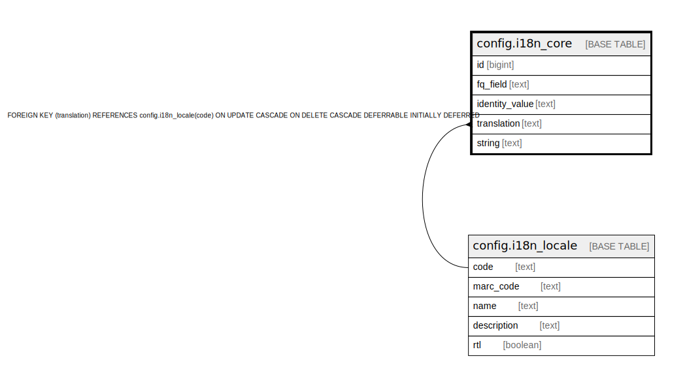

# config.i18n_core

## Description

## Columns

| Name | Type | Default | Nullable | Children | Parents | Comment |
| ---- | ---- | ------- | -------- | -------- | ------- | ------- |
| id | bigint | nextval('config.i18n_core_id_seq'::regclass) | false |  |  |  |
| fq_field | text |  | false |  |  |  |
| identity_value | text |  | false |  |  |  |
| translation | text |  | false |  | [config.i18n_locale](config.i18n_locale.md) |  |
| string | text |  | false |  |  |  |

## Constraints

| Name | Type | Definition |
| ---- | ---- | ---------- |
| i18n_core_pkey | PRIMARY KEY | PRIMARY KEY (id) |
| i18n_core_translation_fkey | FOREIGN KEY | FOREIGN KEY (translation) REFERENCES config.i18n_locale(code) ON UPDATE CASCADE ON DELETE CASCADE DEFERRABLE INITIALLY DEFERRED |

## Indexes

| Name | Definition |
| ---- | ---------- |
| i18n_core_pkey | CREATE UNIQUE INDEX i18n_core_pkey ON config.i18n_core USING btree (id) |
| i18n_identity | CREATE UNIQUE INDEX i18n_identity ON config.i18n_core USING btree (fq_field, identity_value, translation) |

## Relations

---

> Generated by [tbls](https://github.com/k1LoW/tbls)
