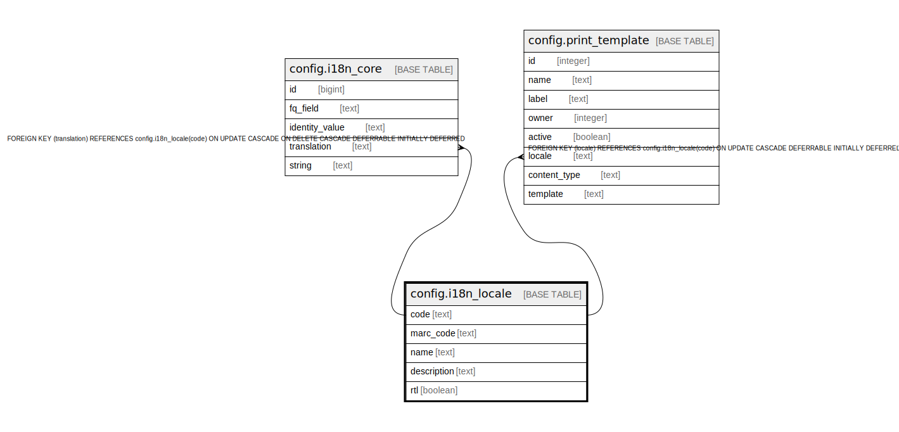

# config.i18n_locale

## Description

## Columns

| Name | Type | Default | Nullable | Children | Parents | Comment |
| ---- | ---- | ------- | -------- | -------- | ------- | ------- |
| code | text |  | false | [config.i18n_core](config.i18n_core.md) [config.print_template](config.print_template.md) |  |  |
| marc_code | text |  | false |  |  |  |
| name | text |  | false |  |  |  |
| description | text |  | true |  |  |  |
| rtl | boolean | false | false |  |  |  |

## Constraints

| Name | Type | Definition |
| ---- | ---- | ---------- |
| i18n_locale_name_key | UNIQUE | UNIQUE (name) |
| i18n_locale_pkey | PRIMARY KEY | PRIMARY KEY (code) |

## Indexes

| Name | Definition |
| ---- | ---------- |
| i18n_locale_name_key | CREATE UNIQUE INDEX i18n_locale_name_key ON config.i18n_locale USING btree (name) |
| i18n_locale_pkey | CREATE UNIQUE INDEX i18n_locale_pkey ON config.i18n_locale USING btree (code) |

## Relations

---

> Generated by [tbls](https://github.com/k1LoW/tbls)
