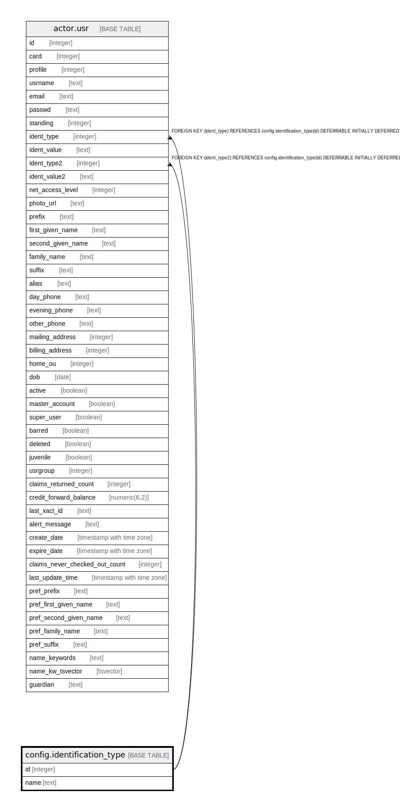

# config.identification_type

## Description

  
Types of valid patron identification.  
  
Each patron must display at least one valid form of identification  
in order to get a library card.  This table lists those forms.  

## Columns

| Name | Type | Default | Nullable | Children | Parents | Comment |
| ---- | ---- | ------- | -------- | -------- | ------- | ------- |
| id | integer | nextval('config.identification_type_id_seq'::regclass) | false | [actor.usr](actor.usr.md) |  |  |
| name | text |  | false |  |  |  |

## Constraints

| Name | Type | Definition |
| ---- | ---- | ---------- |
| identification_type_name_key | UNIQUE | UNIQUE (name) |
| identification_type_pkey | PRIMARY KEY | PRIMARY KEY (id) |

## Indexes

| Name | Definition |
| ---- | ---------- |
| identification_type_name_key | CREATE UNIQUE INDEX identification_type_name_key ON config.identification_type USING btree (name) |
| identification_type_pkey | CREATE UNIQUE INDEX identification_type_pkey ON config.identification_type USING btree (id) |

## Relations

---

> Generated by [tbls](https://github.com/k1LoW/tbls)
