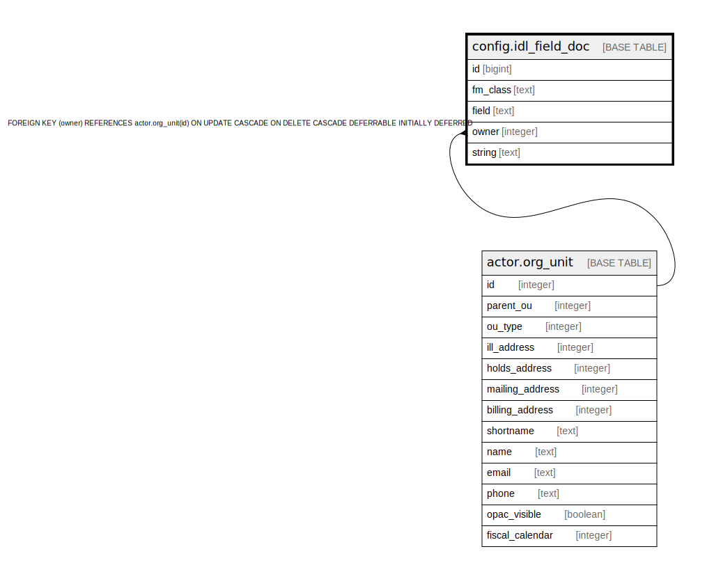

# config.idl_field_doc

## Description

## Columns

| Name | Type | Default | Nullable | Children | Parents | Comment |
| ---- | ---- | ------- | -------- | -------- | ------- | ------- |
| id | bigint | nextval('config.idl_field_doc_id_seq'::regclass) | false |  |  |  |
| fm_class | text |  | false |  |  |  |
| field | text |  | false |  |  |  |
| owner | integer |  | false |  | [actor.org_unit](actor.org_unit.md) |  |
| string | text |  | false |  |  |  |

## Constraints

| Name | Type | Definition |
| ---- | ---- | ---------- |
| idl_field_doc_owner_fkey | FOREIGN KEY | FOREIGN KEY (owner) REFERENCES actor.org_unit(id) ON UPDATE CASCADE ON DELETE CASCADE DEFERRABLE INITIALLY DEFERRED |
| idl_field_doc_pkey | PRIMARY KEY | PRIMARY KEY (id) |

## Indexes

| Name | Definition |
| ---- | ---------- |
| idl_field_doc_pkey | CREATE UNIQUE INDEX idl_field_doc_pkey ON config.idl_field_doc USING btree (id) |
| idl_field_doc_identity | CREATE UNIQUE INDEX idl_field_doc_identity ON config.idl_field_doc USING btree (fm_class, field, owner) |

## Relations

---

> Generated by [tbls](https://github.com/k1LoW/tbls)
