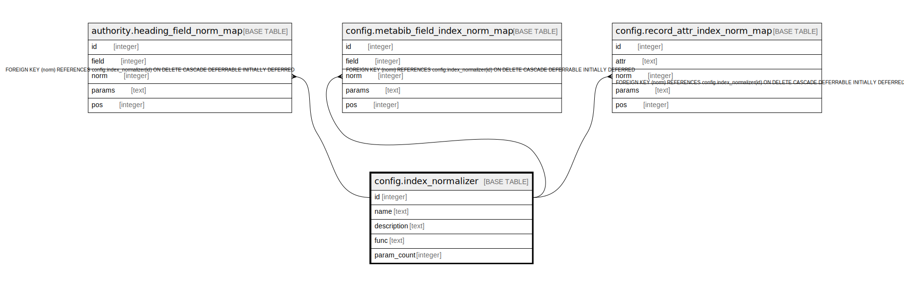

# config.index_normalizer

## Description

## Columns

| Name | Type | Default | Nullable | Children | Parents | Comment |
| ---- | ---- | ------- | -------- | -------- | ------- | ------- |
| id | integer | nextval('config.index_normalizer_id_seq'::regclass) | false | [authority.heading_field_norm_map](authority.heading_field_norm_map.md) [config.metabib_field_index_norm_map](config.metabib_field_index_norm_map.md) [config.record_attr_index_norm_map](config.record_attr_index_norm_map.md) |  |  |
| name | text |  | false |  |  |  |
| description | text |  | true |  |  |  |
| func | text |  | false |  |  |  |
| param_count | integer | 0 | false |  |  |  |

## Constraints

| Name | Type | Definition |
| ---- | ---- | ---------- |
| index_normalizer_name_key | UNIQUE | UNIQUE (name) |
| index_normalizer_pkey | PRIMARY KEY | PRIMARY KEY (id) |

## Indexes

| Name | Definition |
| ---- | ---------- |
| index_normalizer_name_key | CREATE UNIQUE INDEX index_normalizer_name_key ON config.index_normalizer USING btree (name) |
| index_normalizer_pkey | CREATE UNIQUE INDEX index_normalizer_pkey ON config.index_normalizer USING btree (id) |

## Relations

---

> Generated by [tbls](https://github.com/k1LoW/tbls)
