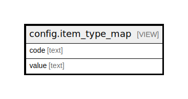

# config.item_type_map

## Description

<details>
<summary><strong>Table Definition</strong></summary>

```sql
CREATE VIEW item_type_map AS (
 SELECT coded_value_map.code,
    coded_value_map.value
   FROM config.coded_value_map
  WHERE (coded_value_map.ctype = 'item_type'::text)
)
```

</details>

## Columns

| Name | Type | Default | Nullable | Children | Parents | Comment |
| ---- | ---- | ------- | -------- | -------- | ------- | ------- |
| code | text |  | true |  |  |  |
| value | text |  | true |  |  |  |

## Referenced Tables

| Name | Columns | Comment | Type |
| ---- | ------- | ------- | ---- |
| [config.coded_value_map](config.coded_value_map.md) | 9 |  | BASE TABLE |

## Relations



---

> Generated by [tbls](https://github.com/k1LoW/tbls)
