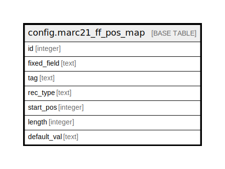

# config.marc21_ff_pos_map

## Description

## Columns

| Name | Type | Default | Nullable | Children | Parents | Comment |
| ---- | ---- | ------- | -------- | -------- | ------- | ------- |
| id | integer | nextval('config.marc21_ff_pos_map_id_seq'::regclass) | false |  |  |  |
| fixed_field | text |  | false |  |  |  |
| tag | text |  | false |  |  |  |
| rec_type | text |  | false |  |  |  |
| start_pos | integer |  | false |  |  |  |
| length | integer |  | false |  |  |  |
| default_val | text | ' '::text | false |  |  |  |

## Constraints

| Name | Type | Definition |
| ---- | ---- | ---------- |
| marc21_ff_pos_map_pkey | PRIMARY KEY | PRIMARY KEY (id) |

## Indexes

| Name | Definition |
| ---- | ---------- |
| marc21_ff_pos_map_pkey | CREATE UNIQUE INDEX marc21_ff_pos_map_pkey ON config.marc21_ff_pos_map USING btree (id) |

## Relations

---

> Generated by [tbls](https://github.com/k1LoW/tbls)
