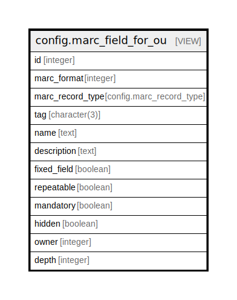

# config.marc_field_for_ou

## Description

<details>
<summary><strong>Table Definition</strong></summary>

```sql
CREATE VIEW marc_field_for_ou AS (
 WITH RECURSIVE ou_marc_fields(id, marc_format, marc_record_type, tag, name, description, fixed_field, repeatable, mandatory, hidden, owner, depth) AS (
         SELECT marc_field.id,
            marc_field.marc_format,
            marc_field.marc_record_type,
            marc_field.tag,
            marc_field.name,
            marc_field.description,
            marc_field.fixed_field,
            marc_field.repeatable,
            marc_field.mandatory,
            marc_field.hidden,
            marc_field.owner,
            0 AS "?column?"
           FROM config.marc_field
          WHERE (marc_field.owner IS NULL)
        UNION
         SELECT marc_field.id,
            marc_field.marc_format,
            marc_field.marc_record_type,
            marc_field.tag,
            marc_field.name,
            marc_field.description,
            marc_field.fixed_field,
            marc_field.repeatable,
            marc_field.mandatory,
            marc_field.hidden,
            marc_field.owner,
            0
           FROM config.marc_field
          WHERE (NOT (ARRAY[(marc_field.marc_format)::text, (marc_field.marc_record_type)::text, (marc_field.tag)::text] IN ( SELECT ARRAY[(marc_field_1.marc_format)::text, (marc_field_1.marc_record_type)::text, (marc_field_1.tag)::text] AS "array"
                   FROM config.marc_field marc_field_1
                  WHERE (marc_field_1.owner IS NULL))))
        UNION
         SELECT c.id,
            c.marc_format,
            c.marc_record_type,
            c.tag,
            COALESCE(c.name, p.name) AS "coalesce",
            COALESCE(c.description, p.description) AS "coalesce",
            COALESCE(c.fixed_field, p.fixed_field) AS "coalesce",
            COALESCE(c.repeatable, p.repeatable) AS "coalesce",
            COALESCE(c.mandatory, p.mandatory) AS "coalesce",
            COALESCE(c.hidden, p.hidden) AS "coalesce",
            c.owner,
            (p.depth + 1)
           FROM ((config.marc_field c
             JOIN ou_marc_fields p USING (marc_format, marc_record_type, tag))
             JOIN actor.org_unit aou ON ((c.owner = aou.id)))
          WHERE ((aou.parent_ou = p.owner) OR ((aou.parent_ou IS NULL) AND (p.owner IS NULL)))
        )
 SELECT ou_marc_fields.id,
    ou_marc_fields.marc_format,
    ou_marc_fields.marc_record_type,
    ou_marc_fields.tag,
    ou_marc_fields.name,
    ou_marc_fields.description,
    ou_marc_fields.fixed_field,
    ou_marc_fields.repeatable,
    ou_marc_fields.mandatory,
    ou_marc_fields.hidden,
    ou_marc_fields.owner,
    ou_marc_fields.depth
   FROM ou_marc_fields
)
```

</details>

## Columns

| Name | Type | Default | Nullable | Children | Parents | Comment |
| ---- | ---- | ------- | -------- | -------- | ------- | ------- |
| id | integer |  | true |  |  |  |
| marc_format | integer |  | true |  |  |  |
| marc_record_type | config.marc_record_type |  | true |  |  |  |
| tag | character(3) |  | true |  |  |  |
| name | text |  | true |  |  |  |
| description | text |  | true |  |  |  |
| fixed_field | boolean |  | true |  |  |  |
| repeatable | boolean |  | true |  |  |  |
| mandatory | boolean |  | true |  |  |  |
| hidden | boolean |  | true |  |  |  |
| owner | integer |  | true |  |  |  |
| depth | integer |  | true |  |  |  |

## Referenced Tables

| Name | Columns | Comment | Type |
| ---- | ------- | ------- | ---- |
| [config.marc_field](config.marc_field.md) | 11 | <br>This table stores a list of MARC fields recognized by the Evergreen<br>instance.  Note that we're not aiming for completely generic ISO2709<br>support: we're assuming things like three characters for a tag,<br>one-character subfield labels, two indicators per variable data field,<br>and the like, all of which are technically specializations of ISO2709.<br><br>Of particular significance is the owner column; if it's set to a null<br>value, the field definition is assumed to come from a national<br>standards body; if it's set to a non-null value, the field definition<br>is an OU-level addition to or override of the standard.<br> | BASE TABLE |
| [ou_marc_fields](ou_marc_fields.md) | 0 |  |  |
| [actor.org_unit](actor.org_unit.md) | 13 |  | BASE TABLE |

## Relations



---

> Generated by [tbls](https://github.com/k1LoW/tbls)
