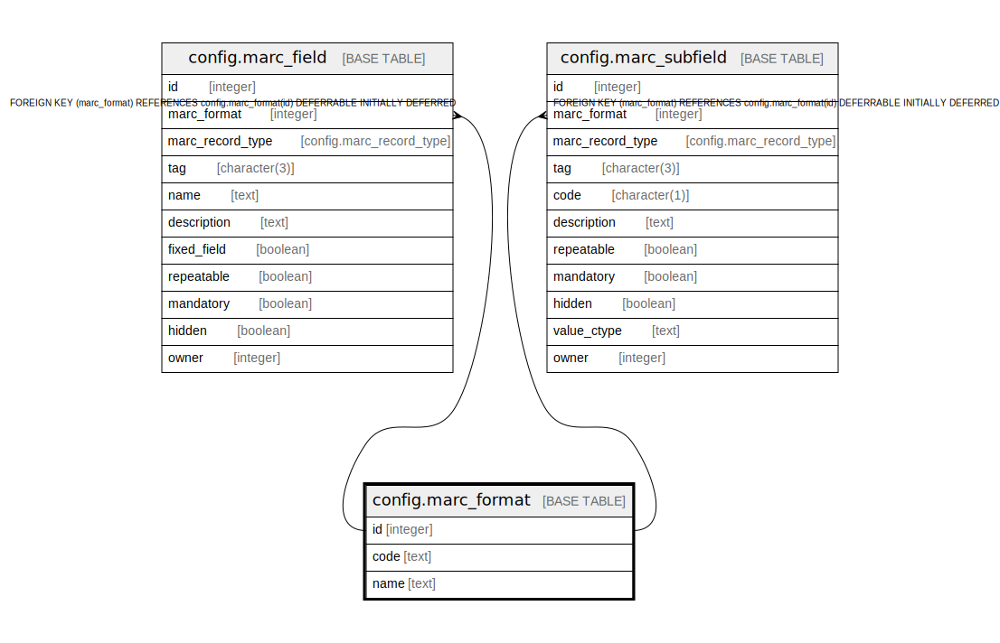

# config.marc_format

## Description

  
List of MARC formats supported by this Evergreen  
database. This exists primarily as a hook for future  
support of UNIMARC, though whether that will ever  
happen remains to be seen.  

## Columns

| Name | Type | Default | Nullable | Children | Parents | Comment |
| ---- | ---- | ------- | -------- | -------- | ------- | ------- |
| id | integer | nextval('config.marc_format_id_seq'::regclass) | false | [config.marc_field](config.marc_field.md) [config.marc_subfield](config.marc_subfield.md) |  |  |
| code | text |  | false |  |  |  |
| name | text |  | false |  |  |  |

## Constraints

| Name | Type | Definition |
| ---- | ---- | ---------- |
| marc_format_pkey | PRIMARY KEY | PRIMARY KEY (id) |

## Indexes

| Name | Definition |
| ---- | ---------- |
| marc_format_pkey | CREATE UNIQUE INDEX marc_format_pkey ON config.marc_format USING btree (id) |

## Relations

---

> Generated by [tbls](https://github.com/k1LoW/tbls)
