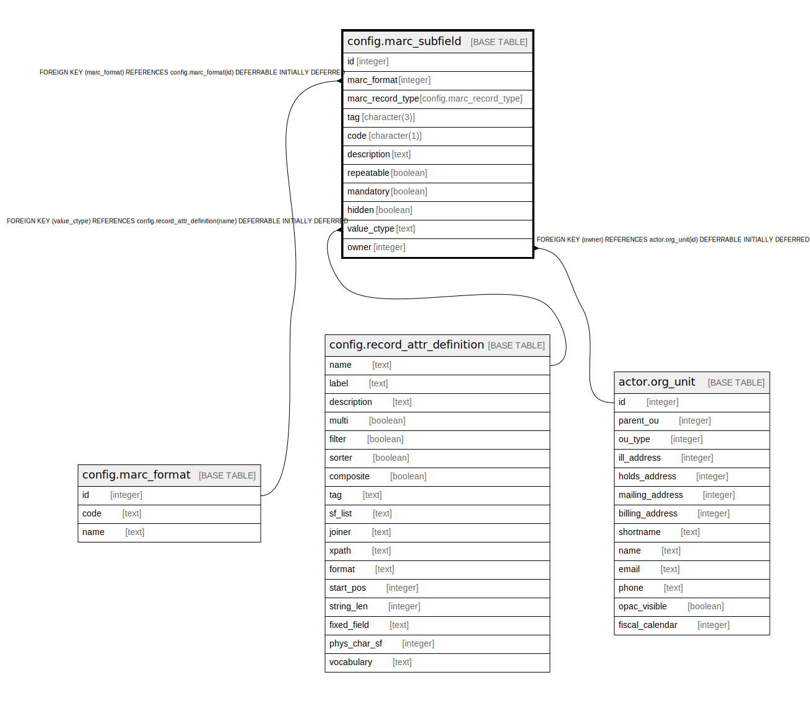

# config.marc_subfield

## Description

  
This table stores the list of subfields recognized by this Evergreen  
instance.  As with config.marc_field, of particular significance is the  
owner column; if it's set to a null value, the subfield definition is  
assumed to come from a national standards body; if it's set to a non-null  
value, the subfield definition is an OU-level addition to or override  
of the standard.  

## Columns

| Name | Type | Default | Nullable | Children | Parents | Comment |
| ---- | ---- | ------- | -------- | -------- | ------- | ------- |
| id | integer | nextval('config.marc_subfield_id_seq'::regclass) | false |  |  |  |
| marc_format | integer |  | false |  | [config.marc_format](config.marc_format.md) |  |
| marc_record_type | config.marc_record_type |  | false |  |  |  |
| tag | character(3) |  | false |  |  |  |
| code | character(1) |  | false |  |  |  |
| description | text |  | true |  |  |  |
| repeatable | boolean |  | true |  |  |  |
| mandatory | boolean |  | true |  |  |  |
| hidden | boolean |  | true |  |  |  |
| value_ctype | text |  | true |  | [config.record_attr_definition](config.record_attr_definition.md) |  |
| owner | integer |  | true |  | [actor.org_unit](actor.org_unit.md) |  |

## Constraints

| Name | Type | Definition |
| ---- | ---- | ---------- |
| config_standard_marc_subfields_are_fully_specified | CHECK | CHECK (((owner IS NOT NULL) OR ((owner IS NULL) AND (repeatable IS NOT NULL) AND (mandatory IS NOT NULL) AND (hidden IS NOT NULL)))) |
| config_marc_subfield_owner_fkey | FOREIGN KEY | FOREIGN KEY (owner) REFERENCES actor.org_unit(id) DEFERRABLE INITIALLY DEFERRED |
| marc_subfield_marc_format_fkey | FOREIGN KEY | FOREIGN KEY (marc_format) REFERENCES config.marc_format(id) DEFERRABLE INITIALLY DEFERRED |
| marc_subfield_pkey | PRIMARY KEY | PRIMARY KEY (id) |
| marc_subfield_value_ctype_fkey | FOREIGN KEY | FOREIGN KEY (value_ctype) REFERENCES config.record_attr_definition(name) DEFERRABLE INITIALLY DEFERRED |

## Indexes

| Name | Definition |
| ---- | ---------- |
| marc_subfield_pkey | CREATE UNIQUE INDEX marc_subfield_pkey ON config.marc_subfield USING btree (id) |
| config_marc_subfield_tag_code_idx | CREATE INDEX config_marc_subfield_tag_code_idx ON config.marc_subfield USING btree (tag, code) |
| config_standard_marc_subfields_are_unique | CREATE UNIQUE INDEX config_standard_marc_subfields_are_unique ON config.marc_subfield USING btree (marc_format, marc_record_type, tag, code) WHERE (owner IS NULL) |

## Relations

---

> Generated by [tbls](https://github.com/k1LoW/tbls)
