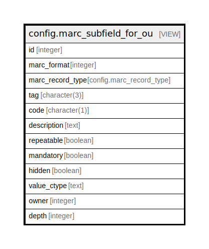

# config.marc_subfield_for_ou

## Description

<details>
<summary><strong>Table Definition</strong></summary>

```sql
CREATE VIEW marc_subfield_for_ou AS (
 WITH RECURSIVE ou_marc_subfields(id, marc_format, marc_record_type, tag, code, description, repeatable, mandatory, hidden, value_ctype, owner, depth) AS (
         SELECT marc_subfield.id,
            marc_subfield.marc_format,
            marc_subfield.marc_record_type,
            marc_subfield.tag,
            marc_subfield.code,
            marc_subfield.description,
            marc_subfield.repeatable,
            marc_subfield.mandatory,
            marc_subfield.hidden,
            marc_subfield.value_ctype,
            marc_subfield.owner,
            0 AS "?column?"
           FROM config.marc_subfield
          WHERE (marc_subfield.owner IS NULL)
        UNION
         SELECT marc_subfield.id,
            marc_subfield.marc_format,
            marc_subfield.marc_record_type,
            marc_subfield.tag,
            marc_subfield.code,
            marc_subfield.description,
            marc_subfield.repeatable,
            marc_subfield.mandatory,
            marc_subfield.hidden,
            marc_subfield.value_ctype,
            marc_subfield.owner,
            0
           FROM config.marc_subfield
          WHERE (NOT (ARRAY[(marc_subfield.marc_format)::text, (marc_subfield.marc_record_type)::text, (marc_subfield.tag)::text, (marc_subfield.code)::text] IN ( SELECT ARRAY[(marc_subfield_1.marc_format)::text, (marc_subfield_1.marc_record_type)::text, (marc_subfield_1.tag)::text, (marc_subfield_1.code)::text] AS "array"
                   FROM config.marc_subfield marc_subfield_1
                  WHERE (marc_subfield_1.owner IS NULL))))
        UNION
         SELECT c.id,
            c.marc_format,
            c.marc_record_type,
            c.tag,
            c.code,
            COALESCE(c.description, p.description) AS "coalesce",
            COALESCE(c.repeatable, p.repeatable) AS "coalesce",
            COALESCE(c.mandatory, p.mandatory) AS "coalesce",
            COALESCE(c.hidden, p.hidden) AS "coalesce",
            COALESCE(c.value_ctype, p.value_ctype) AS "coalesce",
            c.owner,
            (p.depth + 1)
           FROM ((config.marc_subfield c
             JOIN ou_marc_subfields p USING (marc_format, marc_record_type, tag, code))
             JOIN actor.org_unit aou ON ((c.owner = aou.id)))
          WHERE ((aou.parent_ou = p.owner) OR ((aou.parent_ou IS NULL) AND (p.owner IS NULL)))
        )
 SELECT ou_marc_subfields.id,
    ou_marc_subfields.marc_format,
    ou_marc_subfields.marc_record_type,
    ou_marc_subfields.tag,
    ou_marc_subfields.code,
    ou_marc_subfields.description,
    ou_marc_subfields.repeatable,
    ou_marc_subfields.mandatory,
    ou_marc_subfields.hidden,
    ou_marc_subfields.value_ctype,
    ou_marc_subfields.owner,
    ou_marc_subfields.depth
   FROM ou_marc_subfields
)
```

</details>

## Columns

| Name | Type | Default | Nullable | Children | Parents | Comment |
| ---- | ---- | ------- | -------- | -------- | ------- | ------- |
| id | integer |  | true |  |  |  |
| marc_format | integer |  | true |  |  |  |
| marc_record_type | config.marc_record_type |  | true |  |  |  |
| tag | character(3) |  | true |  |  |  |
| code | character(1) |  | true |  |  |  |
| description | text |  | true |  |  |  |
| repeatable | boolean |  | true |  |  |  |
| mandatory | boolean |  | true |  |  |  |
| hidden | boolean |  | true |  |  |  |
| value_ctype | text |  | true |  |  |  |
| owner | integer |  | true |  |  |  |
| depth | integer |  | true |  |  |  |

## Referenced Tables

| Name | Columns | Comment | Type |
| ---- | ------- | ------- | ---- |
| [config.marc_subfield](config.marc_subfield.md) | 11 | <br>This table stores the list of subfields recognized by this Evergreen<br>instance.  As with config.marc_field, of particular significance is the<br>owner column; if it's set to a null value, the subfield definition is<br>assumed to come from a national standards body; if it's set to a non-null<br>value, the subfield definition is an OU-level addition to or override<br>of the standard.<br> | BASE TABLE |
| [ou_marc_subfields](ou_marc_subfields.md) | 0 |  |  |
| [actor.org_unit](actor.org_unit.md) | 13 |  | BASE TABLE |

## Relations



---

> Generated by [tbls](https://github.com/k1LoW/tbls)
