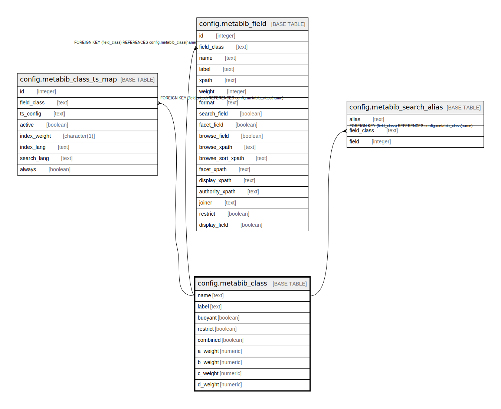

# config.metabib_class

## Description

## Columns

| Name | Type | Default | Nullable | Children | Parents | Comment |
| ---- | ---- | ------- | -------- | -------- | ------- | ------- |
| name | text |  | false | [config.metabib_class_ts_map](config.metabib_class_ts_map.md) [config.metabib_field](config.metabib_field.md) [config.metabib_search_alias](config.metabib_search_alias.md) |  |  |
| label | text |  | false |  |  |  |
| buoyant | boolean | false | false |  |  |  |
| restrict | boolean | false | false |  |  |  |
| combined | boolean | false | false |  |  |  |
| a_weight | numeric | 1.0 | false |  |  |  |
| b_weight | numeric | 0.4 | false |  |  |  |
| c_weight | numeric | 0.2 | false |  |  |  |
| d_weight | numeric | 0.1 | false |  |  |  |

## Constraints

| Name | Type | Definition |
| ---- | ---- | ---------- |
| metabib_class_label_key | UNIQUE | UNIQUE (label) |
| metabib_class_pkey | PRIMARY KEY | PRIMARY KEY (name) |

## Indexes

| Name | Definition |
| ---- | ---------- |
| metabib_class_label_key | CREATE UNIQUE INDEX metabib_class_label_key ON config.metabib_class USING btree (label) |
| metabib_class_pkey | CREATE UNIQUE INDEX metabib_class_pkey ON config.metabib_class USING btree (name) |

## Relations

---

> Generated by [tbls](https://github.com/k1LoW/tbls)
