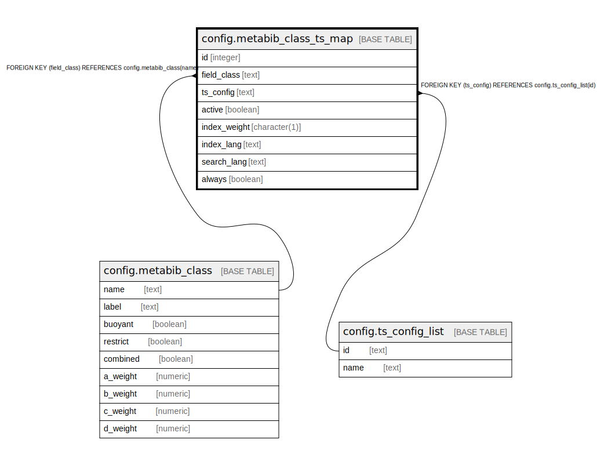

# config.metabib_class_ts_map

## Description

  
Text Search Configs for metabib class indexing  
  
This table contains text search config definitions for  
storing index_vector values.  

## Columns

| Name | Type | Default | Nullable | Children | Parents | Comment |
| ---- | ---- | ------- | -------- | -------- | ------- | ------- |
| id | integer | nextval('config.metabib_class_ts_map_id_seq'::regclass) | false |  |  |  |
| field_class | text |  | false |  | [config.metabib_class](config.metabib_class.md) |  |
| ts_config | text |  | false |  | [config.ts_config_list](config.ts_config_list.md) |  |
| active | boolean | true | false |  |  |  |
| index_weight | character(1) | 'C'::bpchar | false |  |  |  |
| index_lang | text |  | true |  |  |  |
| search_lang | text |  | true |  |  |  |
| always | boolean | true | false |  |  |  |

## Constraints

| Name | Type | Definition |
| ---- | ---- | ---------- |
| metabib_class_ts_map_index_weight_check | CHECK | CHECK ((index_weight = ANY (ARRAY['A'::bpchar, 'B'::bpchar, 'C'::bpchar, 'D'::bpchar]))) |
| metabib_class_ts_map_field_class_fkey | FOREIGN KEY | FOREIGN KEY (field_class) REFERENCES config.metabib_class(name) |
| metabib_class_ts_map_pkey | PRIMARY KEY | PRIMARY KEY (id) |
| metabib_class_ts_map_ts_config_fkey | FOREIGN KEY | FOREIGN KEY (ts_config) REFERENCES config.ts_config_list(id) |

## Indexes

| Name | Definition |
| ---- | ---------- |
| metabib_class_ts_map_pkey | CREATE UNIQUE INDEX metabib_class_ts_map_pkey ON config.metabib_class_ts_map USING btree (id) |

## Relations

---

> Generated by [tbls](https://github.com/k1LoW/tbls)
